# Programación Orientada a Objetos
## Bases de POO
Luego de haber aprendido la programación estructural en fundamentos
de programación, es hora de explorar de las diferentes formas que disponemos
para resolver un problema, que no sea solo resolver el problema descomponiéndolo
y resolver pequeñas partes de ese problema.

Es aquí donde entra el paradigma (Forma de ver un problema) de la programación orientada
a objetos. En el paradigma de la programación orientada a objetos, no descomponemos 
el problema en problemas más pequeños, mas bien, lo descomponemos en objetos del mundo real.

### Objeto
Es la representación abstracta de una entidad o de un concepto. También se lo asocia 
con un elemento del problema.

Los objetos poseen **estados** y **comportamientos**:
- Estados: Valores de sus propiedades (atributos = propiedades).
- Comportamientos: Acciones que puede realizar el objeto (métodos).

### Clase
Una clase es un plano o mapa que define cuáles son los atributos y métodos
que un objeto tendrá. También se la conoce como **unidad básica** en POO.

- 

Entonces, cada clase define la plantilla de cómo se verá el objeto. El objeto, es, en realidad, la instancia de la plantilla o clase. De esta forma, cada objeto es independiente
y tiene su propio estado.

### Pilares fundamentales de la programación Orientada a Objetos
#### Abstracción
Consiste en aislar los elementos esenciales de un objeto para crear su "molde" (clase), 
ocultando los detalles que no son relevantes para el sistema (Pero sí para la clase).

 - Piensa en un automóvil. Para conducirlo, solo necesitas interactuar con el volante, los pedales y la palanca de cambios. No necesitas saber exactamente cómo calcula la computadora la inyección de combustible o cómo funciona internamente el motor.

#### Encapsulamiento
Es la acción de reunir los datos (atributos) y los comportamientos (métodos) dentro de una
misma estructura (la clase), y restringir el acceso directo a ellos desde el exterior
(Ésto se logra con las keyWords public, private, default, ...).

 - Piensa en una cápsula de medicina. Los compuestos químicos están guardados dentro para protegerlos y evitar que se alteren.

#### Herencia
Permite crear nuevas clases a partir de clases ya existentes. La nueva clase (clase hija) "hereda" los atributos y métodos de la clase original (clase padre), lo que evita tener que reescribir código y permite extender sus funciones.

 - Piensa en una clase padre llamada Vehiculo (con atributos como marca y modelo), puedes crear clases hijas como Auto, Moto o Camion. Todas ellas comparten las características de un vehículo, pero cada una puede tener sus propios detalles particulares (como numeroDePuertas en el auto).

#### Polimorfismo 
Es la capacidad de que un mismo método o instrucción se comporte de manera diferente según el objeto que lo esté ejecutando.

Ahora bien, necesitamos un lenguaje para poder aplicar este  paradigma. Por lo que
procederemos a aprender sobre Java.

# Introducción a Java
Java es un lenguaje de alto nivel, multiplataforma y orientado a objetos. 
Lo primero que estudiaremos serán los tipos de datos.

## Tipos de datos 
Un tipo de dato es la especificación de un dominio (rango de valores) de un conjunto válido. En Java existen 8 tipos de datos, llamados primitivos.

### Datos primitivos

Tipos de datos *Numéricos*:
- Byte: valor entero que pertenece al intervalo [-128, 127].

- Short: valor entero que pertenece al intervalo [-32768, 32767].

- Int: valor entero que pertenece al intervalo [-2147483648, 2147483647].

- long: valor entero que pertenece al intervalo [-9223372036854775808, 9223372036854775807].

Tipos de datos *Numéricos flotantes*:
- Float: flotante que pertenece al intervalo de [1.4 x 10-45, 3.4 x 1038].

- Double: flotante que pertenece al intervalo de [4.9 x 10-324, 1.8 x 10308].

Tipos de datos *caracter*:
- Char: Almacena exactamente un caracter.

- Boolean: Valores de verdadero o falso (Lógica proposicional).

### Datos no primitivos (Objetos)
- String: Conjunto de datos tipo Char (Cadenas de texto).

- Scanner: Leer entrada de datos por teclado.

- Arraylist: Creación de arreglos dinámicos.

## Operadores en Java
Existen 5 tipos de operadores en Java.

### Operadores ariméticos
|Operador      |Símbolo       |
|--------------|--------------|
|     ++     |Operador de incremento, utilizado para incrementar el valor en 1.|
|     --     |Operador de decremento , usado para disminuir el valor en 1.|

- *Pre-(Incremento/Decremento)*: El valor se incrementa/decrementa primero
y luego se calcula el resultado.

- *Post-(Incremento/Decremento)*: el valor se usa por primera vez para calcular
el resultado y luego se incrementa /decrementa.

- Ejemplo de expresiones: ++a, a++, --a, --a.

### Operadores Unarios
Los operadores Unarios sólo necesitan un operando.

|Operador      |Descripción       |
|--------------|--------------|
| ==             |    Es igual     |
| !=            |    Es distinto     |
| <   |    Menor     |
| <=         | Menor o igual        |
| >  | Mayor       |
| >= | Mayor o igual        |
| &&         |     Operador Conjunción   |
| Or (Dos barras verticales) | Operador disyunción inclusiva       |
| ! | Operador negación        |

## Comentarios en el código
### Código de una sola línea
```Java
// Éste es un comentario de una sola línea
```

### Código multilínea 
```Java
/* Ejemplo de comentarios
*Este es un comentario multilínea
*/
```

## Sobre escribir como en python (De la nada)
Primero que todo, en Java, **Nada puede existir fuera de una clase**. Todas las variables
(atributos) y funciones (métodos) deben de estar en una clase, de lo contrario, no existe
y el fichero no se podría compilar. Esto es debido a que java es un lenguaje orientado a 
objetos (Todo existe solo con una clase y nada existe sin una).

## Sobre cómo crear una plantilla (Clase)
La estructura para crear una clase siempre será la siguiente:
```Java
visibilidad class NombreDeClase{
  // code
}
```
Por ejemplo:
```Java
public class Estudiante {
  // code
}
```

El nombre de la clase siempre irá en **PascalCase**. Siempre y cuando **exista una clase
con visibilidad pública, las demás deberán de ser del tipo default**.

## Tipos de visibilidades
Cómo las demas clases ven a una clase.
- Public: Lo ve cualquier clase del proyecto (Cualquier carpeta).
- Protected: Lo ven las clases de la misma carpeta y sus subclases (Herencia).
- Default: Solo lo ven las clases que comparten la misma carpeta.
- Private: Solo lo ve la misma clase que lo contiene entre sus llaves.

Aunque en la práctica no es "sólo ver" la clase sino mas bien instanciarla.

### Sobre clases privadas
Existen clases privadas tanto dentro de la clase pública como dentro de una clase con visibilidad por defecto. No existen clases privadas fuera de la clase pública (No tendría sentido ocultarse de nadie).


### Cómo crear clases
Con esto podemos escribir el siguiente código y note que, a priori, no daría error.
```Java
// Nombre archivo: carro.java 
// Así, no es necesario que tengan el mismo nombre de la clase
// Visibilidad por defecto

class Vehicle {
  String color;
  int power;
  int seats;
}
```

```Java
// Nombre archivo: Vehicle.java
// Si es public, debe llamarse como el fichero
public class Vehicle {
  String color;
  int power;
  int seats;
}
```

En ambos casos, si lo llegase a compilar y a ejectuar, le saldría el mensaje de que 
efectivamente existe la plantilla pero no tiene un método Main (Nada a ejecutar).

### Método Main
Podrías verlo como el botón de encendido de la clase. Es lo primero que Java busca
a toda velocidad en una clase. Éste indica desde dónde se iniciará el programa.

```Java
public static void main(String[] args)
```

Cabe aclarar que éste método **siempre** es público.

#### Ejemplo práctico de una clase
```Java
// Nombre archivo: Main.java

class Estudiante {
  String nombre;
  static String universidad = "ESPOL";
}
 
public class Main {
  public static void main(String[] args) {
    Estudiante e1 = new Estudiante();
    Estudiante e2 = new Estudiante();

    e1.nombre = "Carlos";
    e2.nombre = "Ana";

    System.out.println(e1.nombre);
    System.out.println(e2.nombre);

  // ambos comparten universidad
    System.out.println(Estudiante.universidad);
  }
}
```

### Declaración de variables
La estructura para delcarar una variable es la siguiente:
```Java
// nombre archivo: Main.java
public class Main {
  modificadorTipo nombreVariable; // el nombre va en camelCase
}
```

## Tipos de modificadores en variables (Igual que en las clases)
- Private: Sólo la misma clase puede acceder a ella (dentro de sus respectivos {}).
- Default: Sólo lo ven las clases que comparten la misma carpeta.
- Protected: Lo mismo que el default inclyendo a las subclases.
- Public: Vista general, todos pueden ver la variable y manipularla.

## Declaración de métodos
Los métodos son simplemente las funciones que existen dentro de una clase, que
pertenecen a un objeto en particular. Solemos decir que los métodos de un objeto
son las acciones que puede realizar.

La estructura para delcarar un método es la siguiente:
```Java
// nombre archivo: Main.java
public class Main {
  // code

  modificador tipo nombreMetodo(parameter-list) {
    // code

    return variableDeTipotipo;
  }
}
```

### Firma de un método
La firma de un método es cómo Java ve al método al momento
de guardar espacio en la memoria. Por ejemplo:

```Java
public int acelerar(int velocidadInicial, String tipoTerreno) {
    // Lógica aquí...
    return 100;
}
```

Su firma es: acelerar(int, String)

### Tipos de datos de un método 
Con el **tipo** nos referimos al dato que retornará la función. Por ejemplo,
si quisieramos sumar números, entonces la función tendría que retornar un número
(entero o decimal), también pueden retornar objetos. Pueden haber casos en los 
que queremos que una función no retorne nada, por lo que usamos la keyword **void**.

## Ubicación del proyecto Java en código (package)
Al momento de crear un archivo Java, con el propósito de desarrollar una solución, es recomendable
trabajar esa solución como un proyecto. Ahora bien, la sintaxis para indicarle a Java el
"proyecto" en el que "vive el fichero .java" es la siguiente:

```Java
package nombreDeLaCarpetaDelProyecto 

// nombre archivo: Main.java
public class Main {
  // code
}
```

Aunque más bien le estamos diciendo en que carpeta vive el fichero Java.

Si el fichero Java está dentro de la carpeta general, entonces:
```Java
package carpetaGeneral.carpetaHija
// "Oye, tú vives en la carpeta carpetaHija, que a su vez está dentro de la carpetaGeneral

// nombre archivo: Main.java
public class Main {
  // code
}
```

## Llamar a código externo (import)
Si queremos usar código que está en otra carpeta (diferente paquete), usamos
la keyword reservada **import**, de esta forma:

```Java
package ubicacionPaquete

import carpetaPadre.carpetaHija.ficheroJava

// nombre archivo: Main.java
public class Main {
  // code
}
```


## Creación de objetos en Java
Dado que ya tenemos el lugar para escribir código, veamos cómo podemos
crear objetos (instanciar clases). La sintaxis es la siguiente: 

```Java
package nombreDeLaCarpetaDelProyecto 

// nombre archivo: Main.java
public class Main {
  // CrearObjeto
  Type nombre_variable = new Type();
}
```

Así, hacemos uso de la keyword reservada **new**.

## Acceder a las propiedades y métodos de un objeto
Lo más común en el paradigma de la programación orientada a objetos es acceder a
éstos y modificar sus atributos o comportamientos. Nos valemos de la siguiente sintaxis ".":

```Java
package nombreDeLaCarpetaDelProyecto 

// nombre archivo: Main.java
public class Main {
  // CrearObjeto
  Type nombre_variable = new Type();

  nombre_variable.nombreMetodo();
  nombre_variable.nombreAtributo;
}
```

## Valor vs Referencia
Los tipos de datos que encontramos en Java son de 2 tipos: primitivos y de
referencia. 

- **Datos primitivos**: boolean, byte, char, short, int, long, float y double.

- **De referencia**: Todos aquellos que no son primitivos, de hecho, estos tipos 
de datos suelen estar compuestos de datos primitivos (Como Strings).

Java tiene diferentes formas de almacenar los datos dependiendo de su tipo. De hecho, 
las variables de **tipo primitivo almacenan el valor** mientras que las variables de
**tipo clase almacenan la referencia**.

Por ejemplo:


Podría verlo como que el dato solo existe en un lugar de la memoria. Por otro lado, un objeto
es más bien una referencia en la memoria, Java sólo ve hacia donde apunta ese objeto.

De hecho, sea a = 20 y b = a. Entonces, para java, la situación es la siguiente:


En cambio, si creamos objetos, éstos no solamente existen. Los objetos al crarse
apuntan a un lugar de la memoria (Su referencia). Por ejemplo:


Note que si: Pokemon pk4 = pk1; pk4 apuntará a la referencia de un objeto ya creado:


Dado que ambos objetos tienen mismas referencias, al cambiar un atributo de pk4
o pk1, estamos afectando a ambos objetos. De hecho:


## Variables de Instancia vs Variables Locales
### Variables locales
- Es una variable declarada dentro de la definición de un método o función.

- Deben ser inicializadas antes de ser utilizadas (No puede haber un int numeroSuerte; sino int numeroSuerte = 1;)

### Variables de Instancia
- Es la variable definida para todas las intancias de una clase (Estado del objeto).

- Toman un valor predeterminado si no son inicializadas.

### Valor predeterminado para variables de instancia
- **Objetos** -> null

- **int, byte, long** -> 0

- **double, float** -> 0.0

- **char** -> ''

- **boolean** -> false

## Tipo de dato null
Es un valor espacial que se puede asignar a cualquier tipo de referencia. Se usa
para indicar que una variable de referencia **no apunta a un objeto aún**.

Por lo tanto, no es posible int a = null; porque int no es un tipo de dato de referencia
sino primitivo.

Como en Unity con C#, si queremos validar que un objeto no es nulo, entonces se verifica
la proposición **objectName != null** o su equivalente sin negación **objectName == null**.

## Constructores
Los constructores son muy importantes al momento de llamar a un objeto. Cuando nosotros
usamos la keyword **new**: ```Pokemon pk1 = new Pokemon();```; la parte de ```Pokemon()```
hace referencia a su constructor.

Son tipos especiales de métodos de métodos que son responsables de crear e 
inicializar un objeto de esa clase.

Al declarar un constructor debemos de tener en cuenta que:
- Éste tiene el mismo nombre que la clase.

- El constructor no retorna ningún tipo de dato.

- No siempre son públicos.

Por ejemplo:
```Java
// Un fichero
package this

public class Rectangulo {
  String color;
  double ancho;
  double alto;

  //constructor de la clase rectangulo
  public Rectangulo(double w, double h){
  color = "negro";
  ancho = w;
  alto = h;
  }
}

// Otro fichero
package this.children

public class TestRectangulo {
  public static void main(String[] args){
  //crea un nuevo objeto de tipo rectangulo con ancho de 10, alto de 5 y de color negro
  Rectangulo r1 = new Rectangulo(10,5);
  //para acceder a las variables del objeto se usa la notacion de punto
  System.out.println("r1 {ancho:"+r1.ancho+" alto:"+r1.alto+"");

  //crea un nuevo objeto de tipo rectangulo con un ancho de 4 y un alto de 2 y de color negro
  Rectangulo r2 = new Rectangulo(4,2);
  System.out.println("r2 {ancho:"+r1.ancho+" alto:"+r1.alto+"");
  }
}
```

Una objeto no se limita sólo a un constructor, éste puede tener N constructores pero deben
de tener diferentes firmas. No puede haber ```public Cuadro(int alto)``` y ```public Cuadro(int altoN)``` en 
**Cuadro.Java**.

Por ejemplo:

```Java
public class Rectangulo {
  String color;
  double ancho;
  double alto;

  //constructor 1
  public Rectangulo(double w, double h, String colorp){
  color = colorp;
  ancho = w;
  alto = h;
  }

  //constructor 2
  public Rectangulo(double w, double h){
  color = "negro";
  ancho = w;
  alto = h;
  }
}
```

Es importante tomar en cuenta que:
- Toda clase necesita al menos un constructor.

- Si una clase no declara un constructor de forma explícita, 
Java creará el constructor predeterminado en tiempo de compilación.

- El constructor predeterminado es un constructor que no recibe
parámetros y tiene modificador de acceso público.

- Si ya existe un constructor entonces Java no considerará el predeterminado.z

## Keyword **this**
"this" es literalmente una referencia al objeto actual. Se usa esta palabra reservada
cada vez que tengamos que hacer referencia al objeto que invoca al método.

Por ejemplo:

```Java
public class Point {
  public int x = 0;
  public int y = 0;

  //Constructor 
  public Point(int x, int y) {
    this.x = x;
    this.y = y;
  }
}
```
El operador this también es usado dentro de un constructor para llamar a otro constructor
dentro de la misma clase. 

Por ejemplo:

```Java
public class Rectangulo {
  String color;
  double ancho;
  double alto;
  //constructor 1
  public Rectangulo(double ancho, double alto, String color){
    this.ancho = ancho;
    this.alto = alto;
    this.color = color;
  }
  //constructor 2
  public Rectangulo(double ancho, double alto){
    this(ancho,alto,"negro");
  }
}
```

## Manejo de memoria en Java
Existen dos regiones de memoria, tal como se muestra a continuación:


- **Stack**: Usada para almacenar las variables locales.

- **Heap**: Usada para almacenar los objetos (referencias).


# Pilares de POO aplicados a Java
## Encapsulamiento
Es el mecanismo que combina la data y al funcionalidad asociada a ella en una
sola unidad (clase). Ya que el propósito de la clase es encapsular la complejidad, en
Java existen mecanismos para ocultar la complejidad de los detalles de la implementación
dentro de la clase.

En resumen "sólo me importa lo que puede hacer la clase, no cómo lo hace".

La forma de ocultar esos detalles de implementación es a través de los modificadores
de acceso.

### Modificadores de acceso
Los modificadores de accceso determinan a que atributos o métodos se pueden acceder
y a través de quien. La **clase debe** definir cuál es la data y métodos que **quiere exponer**
y cuál es la data y métodos que **quiere ocultar**.

Recordando los respectivos modificadores de acceso:


- El modificador **default** permite el acceso siempre y cuando los solicitantes se 
encuentren en el mismo paquete.

- El modificador **protected** permite acceso siempre y cuando los solicitantes se encuentren
en el mismo paquete y a cualquier subclase incluso cuando no se encuentren en el mismo paquete.

### Getter and Setters
Lo ideal es que los atributos de las clases sean privadas. Para acceder o manipular éstos 
atributos privados hacemos usos de Getters y Setters.

Los Getters y Setters no son nada más que
funciones (métodos) del objeto 

- los Setters y Getters normalmente son métodos con acceso public.

- Los **Setters** no retornan valor alguno (void), sólo sirven para modificar el atributo.

- Los **Getters** son métodos que retornan un valor en específico (Así obtenemos sólo datos que nos interesan).

### Conversión automática de tipo
Java siempre busca una firma de método que coincida exactamente con la invocación
del método. Solo después de que no encuentra una coincidencia exacta, Java intenta 
conversiones de tipo automático para encontrar una definición de método que
coincida con los tipos de la invocación del método.

En la conversión de tipos:


Por ejemplo:

```Java
public void mostrar(long x) {
    System.out.println("Se ejecutó el método con LONG");
}

public void mostrar(double x) {
    System.out.println("Se ejecutó el método con DOUBLE");
}

objeto.mostrar(5); // El número 5 por defecto es un 'int'

// Salida: Se ejecutó el método con LONG
```

Así como sobrecargamos constructores, podemos sobrecargar métodos. Considere el
método M, si desea sobrecargar M, debe mantener el nombre del método pero cambiar el tipo
de dato en sus parámetros (Tipos de datos diferentes de M).
Recuerde que la firma de un método se conforma por su nombre y sus parámetros.

### == Vs object1.equals(object2)
Para comparar valores de variables, tenemos 2 opciones. Normalmente
si los datos que deseamos comparar con primitivos, entonces usamos **==**.
Ahora bien, si deseamos comparar el contenido de objetos, entonces usamos
el método **.equals()**.

```Java
public class Ejercicio2 {
  public static void main(String[] args){
    String a = new String("java");
    String b = new String("java");
    String c = a;

    System.out.println("a==b "+(a==b)); //false
    System.out.println("a==c "+(a==c)); //true
    System.out.println("a.equals(b) "+(a.equals(b))); //true
    System.out.println("a.equals(c) "+(a.equals(c))); //true
  }
}
```

Es posible reescribir el método equals, su firma es la siguiente:
```Java
public boolean equals(Object obj){
  //contenido
}
```

### Modificador final
La keyword especial **final** se usa en Java para decir que el valor de una
variable no va a cambiar una vez que esta es inicializada. Sólo puede ser 
asignada una vez (Al declararse). Es decir:

- **En datos primitivos**: Luego de final, no se puede modificar el dato almacenado en la 
variable (Se queda como constante).

- **En objetos**: Luego de final, se puede modificar el estado del objeto (Atributos) pero
no su referencia. 

- **En métodos**: Luego de final, en caso de que una clase herede esa clase, no será
posible sobreescribir el método.

- **En clases**: Luego de final, no será posible heredar la clase.

### Modificador Static
Permite usar atributos y métodos sin necesidad de crear una instancia de una clase C. 
Cuando se declara un método/variable con static, dichos métodos/variables dejan de pertenecer
a objetos individuales (No son variables de instancia) y pasan a pertenecer a la clase en 
general.

#### Variables estáticas
Una variable estática es una variable que le pertenece a la clase como un todo
y no solo a un objeto (No cambia su valor dependiendo de la instancia). Es decir, hay
una única copia de las variables estáticas que es compartida por todos los
objetos de la clase.

Para declarar variables estáticas:
```Java
public class A{
  modificador-acceso static Type name;
}
```

Cabe aclarar que una variable public static se puede modificar en otras clases (compartido pero modificable).

#### Métodos estáticos
Normalmente designamos como estáticos a los métodos que no realizan ninguna acción 
sobre un objeto ó métodos que realizan simple cálculos matemáticos.

Por ejemplo: 

```Java
public class Alumno {
    private static int contadorAlumnos = 0;

    // Método estático para consultar el total global sin instanciar alumnos
    public static int getContadorAlumnos() {
        return contadorAlumnos;
    }
}
```

Así, no es posible hacer referencia a this en un método estático. **this** implica 
que te estás refiriendo a una variable de instancia, la cual puede ser variable (Rompe
la definición de concepto estático).


# Introducción al manejo de colecciones
## Arreglos de una dimensión
Es una estructura de datos que permite almacenar un conjunto de datos de un **mismo tipo**.
Al declarar el arreglo siempre debemos de especificar su tamaño. Cabe aclarar que los arreglos
son **objetos**.

Para declarar arreglos, consideramos la siguiente sintaxis:
```Java
// Dejándola vacía
Tipo_de_variable[] Nombre_del_array = new Tipo_de_variable[dimensión]; // Caso 1

// Asignando elementos
Tipo_de_variable[] Nombre_del_array = {dato1, dato2, ..., daton};
```

Si dejamos vacío el arreglo (Observe **caso 1**), dependerá del tipo de dato
para los valores por defecto en el arreglo.
Conforme al tipo de dato el arreglo puede ser: 0, '\u0000', false o null.

La **dimensión** podría considerarla como la longitud de la lista.

Por ejemplo:
```Java
char s[]; 
int iArray[];
char[] s;  
int[] iArray;


// o también
int[] numeros = new int[4];

int numeros[] = {2, 4, 6, 8}; 
```

Los tipos de datos válidos en los arreglos son los siguientes:
```Java
byte[ ] edad = new byte[4];
short[ ] edad = new short[4];
int[ ] edad = new int[4];
long[ ] edad = new long[4];
float[ ] estatura = new float[3];
double[ ] estatura = new double[3];
boolean[ ] estado = new boolean[5];
char[ ] sexo = new char[2];
String[ ] nombre = new String[2];
```

Luego de declarar arreglos, podemos acceder a sus elementos mediante sus índices.

Por ejemplo:
```Java
double[] values = {1, 2, 3, 4, 5, 6};
System.out.println(values[5])
// Salida: 6
```

#### Propiedad lenght
Si deseamos conocer la longitud de un arreglo. Es decir, cuantos elementos
existen dentro del arreglo, usamos la propiedad de los arreglos **lenght**.
```Java
// Considere el arreglo numeros
x = numeros.lenght; 
```

### Método Split de los String
El método split retorna un arreglo de tipo String. Por ejemplo:
```Java
String email = "espolads@espol.edu.ec";
String[] partes = email.split("@");
System.out.println(partes[0]); // Salida: espolads
System.out.println(partes[1]); // Salida: espol.edu.ec
```

### Arreglos de dos dimensiones (Matrices)
Es una estructura de datos que permite almacenar un conjunto de datos de un **mismo tipo**.
A diferencia de los arreglos en una dimensión, con los arreeglos de dos dimensiones tenemos
2 dimensiones, **filas y columnas**.

La sintaxis para declarar matrices es la siguiente:
```Java
// Dejándola vacía
Tipo_de_variable[] Nombre_de_matriz = new Tipo_de_variable[filas][columnas]; // Caso 1

// Asignando elementos
Tipo_de_variable[] Nombre_del_array = {{dato1, ..., daton}, ..., {{dato1, ..., daton}}};
```

Si dejamos vacío la matriz (Observe **caso 1**), dependerá del tipo de dato
para los valores por defecto en la matriz.
Conforme al tipo de dato el arreglo puede ser: 0, '\u0000', false o null.

#### Propiedad lenght en matrices
De una matrizz, es posible determinar su cantidad de filas y columnas. Por ejemplo
```Java 
int filas = matriz.lenght;

int columnas = matriz[0].lenght;
```

### Loop For mejorado
En lugar de tener un for anidado para leer cada elemento en una matriz, usamos
el loop for mejorado. Su sintaxis es la siguiente:

```Java
for (typeName variable : collection){
  statements;
}
```

Con esto podemos acceder a cada valor de cada elemento en la matriz pero 
**NO PODEMOS** modificar sus elementos (**Es solo lectura**).

**Con loop for mejorado**:

```Java
double[] values = ...;
double total = 0;

for (double element : value)
{
  total = total + element;
}
```

**Sin loop for mejorado**:

```Java
for (int i = 0; i < values.length; i++)
{
  double element = values[i]
  total = total + element;
}
```

### Clases Wrappers
Los tipos de datos primitivos NO SON OBJETOS. Sin embargo, podemos envolver 
los tipos de datos para que sean objetos, así, podemos tener los beneficios de un objeto
al operar con tipos de datos. La clase Wrapper de cada tipo de dato 

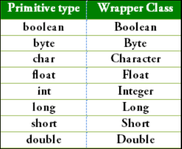

Nos valemos del método valueOf() para convertir un primitivo a su respectiva clase
Wrapper:

```Java
Float f2 = Float.valueOf("3.14");
```

#### Autoboxing y Unboxing
Mecanismos automáticos que tiene Java para convertir datos entre tipos primitivos y sus
respectivas clases envoltorio.

**1. Autoboxing (Primitivo -> Objeto Wrapper)**:
Es la conversión automática que hace el compilador cuando pasas un dato primitivo crudo
a un lugar donde se espera un objeto. Por ejemplo:

```Java
int primitivo = 10;
Integer objeto = primitivo; // Autoboxing automático

// Otro ejemplo
int[] arr = {4, 5, 6, 7};

Integer[] vals = new Integer[10];

for (int = 0; i > vals.length; i++)
{
  vals[i] = arr[i];
}
```

**2. Unboxing (Objeto Wrapper -> Primitivo)**:
Proceso inverso; el compilador extrae automáticamente el valor primitivo que está guardado
dentro del objeto Wrapper.

```Java
Integer objeto = 20;
int primitivo = objeto; // Unboxing automático

// Otro ejemplo
public static int sumOfEven(Integer[] valores)
{
  int sum = 0;
  
  for (Ingerer i : valores)
  {
    if (i % 2 == 0)
    {
      sum += i
    }
  }

  return sum;
}
```

#### Métodos de conversión
- **xxxValue() - Wrapper -> Primitivo**: Extraen el valor numérico contenido dentro de un
objeto Wrapper y lo convierten al tipo primitivo deseado. Por ejemplo:

```Java
Integer var = Integer.valueOf(42);

int i = var.intValue();       // 42 como primitivo int
double d = var.doubleValue(); // 42.0 como primitivo double
byte b = var.byteValue();     // 42 como primitivo byte
```

- **parseXXX() - String -> Primitivo**: Leen una cadena de texto que contiene números y devuelven
directamente el dato primitivo correspondiente. Por ejemplo:

```Java
String texto = "150";
int num = Integer.parseInt(texto);      // Devuelve 150 (tipo primitivo int)

double d = Double.parseDouble("3.14");  // Devuelve 3.14 (tipo primitivo double)
```

- **toString() - (Objeto o primitivo) -> String**: Convierten el valor numérico en una cadena de 
texto legible. Por ejemplo:  

```Java
// Método de instancia:
Integer obj = Integer.valueOf(100);
String str1 = obj.toString(); // "100"

// Método estático (directo desde primitivo):
String str2 = Integer.toString(500); // "500"
```

Ademas objeto.toString() retorna el nombre de la clase + @ + código hash en hexadecimal


## ArrayList
Es una clase que permite almacenar datos en memoria de forma similar a los Arrays.
Aquí se podrán almacenar sólo objetos (Por eso son útiles las clases Wrappers), además 
su estructura es dinámica (No es necesario definir su tamaño al momento de declararse).
La mayor ventaja de los ArrayList, es que pueden ser heterogéneos. Su sintaxis es:

```Java
ArrayList<String> friends = new ArrayList<String>();

friends.add("Cindy");
String name = friends.get(i)
friends.set(i, "Harry");
```

En general:
```Java
arrayListReference.add(Object);

arrayListReference.get(index); // Reemplazar

arrayListReference.set(index, value);
```

### Métodos del ArrayList

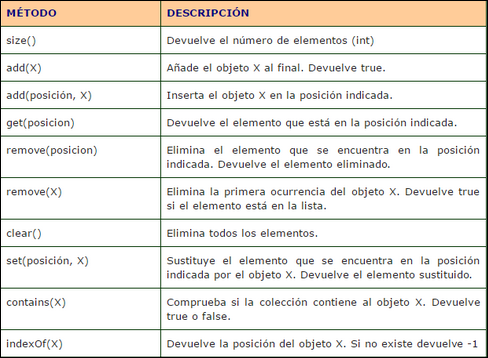

Es posible pasar de ArrayList a Array, basta con **toArray()**. Por ejemplo:

```Java
ArrayList<String> nombres = new ArrayList<>();
nombres.add("Ana");

Object[] arr = nombres.toArray(); // Pierde el tipado específico a String
```

```Java
ArrayList<String> nombres = new ArrayList<>();
nombres.add("Ana");
nombres.add("Carlos");

// Java dimensiona el array automáticamente según el tamaño de la lista:
String[] arrNombres = nombres.toArray(new String[0]);
```

# Herencia, Clases Abstractas, Interfaces y Polimorfismo
## Herencia
- Permite la creación de clasificaciones Jerárquicas.
- Promueve el reuso de código.
- Minimiza el código duplicado.
- Una mejor organización del código.

Es casi imposible escribir un código en Java sin usar herencia. De hecho, basta con
usar la keyword "new" al crear un objeto para que dicho objeto herede de la clase padre
de Java "Object".

Decimos que una clase hereda de otra con la palabra reservada "extends":

```Java
public class Padre
{

}

public class Hijo extends Padre
{

}
```

### IS-A vs HAS-A
En la POO, **IS-A** está relacionado a la herencia. Por ejemplo:
- El brocoli ES-UN vegetal.

- El estudiante ES-UN persona.

- El profesor ES-UN persona.

Ahora bien, **HAS-A** se basa en el uso y no en la herencia. Por ejemplo:
- Un caballo ES-UN Animal, Un caballo TIENE-UNA silla.

Por ejemplo:
- El carro ES-UN vehículo.

- El carro TIENE-UN Motor.

```Java
public class Carro extends Vehiculo
{
  private Motor motor;

  public void mover(double km)
  {
    System.out.print("moviendose " + km + "km");
  }
}
```

### Modificador de acceso Protected
Un miembro de clase, con el modificador "protected" puede acceder
a los atributos de una superclase a través de Herencia, incluso si la subclase está
en paqeutes diferentes (Paquetes + Hijos).

### Keyword especial super();
- Se usa para invocar al constructor de la superclase o clase Padre.

- Se usa para invocar un método de una superclase en un método sobreescrito.

- Para acceder a un miembro de la superclase (en función de sus niveles de acceso).

Por ejemplo:
Asumamos que Horse hereda de la clase Animal:

```Java
Horse caballo = new Horse();
```

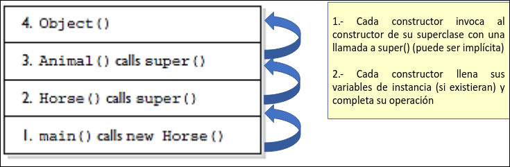

Por cierto, al heredar, lo primero que se debe colocar en el constructor de la subclase es super().
Ya que Padre -> Hijo (Primero se DEBE de definir el padre, luego el hijo):

```Java
class Box
{
  private int width;
  private int height;

  public Box(int width, int height)
  {
    this.width = width;
    this.height = height;
  }
}

class GifBox extends Box
{
  private String color;

  public GiftBox(String color, int width, int height)
  {
    super(width, height); // la primera sentencia en un constructor de subclase
    this.color = color;
  }
}
```

Si el constructor del Padre tuviera argumentos y colocamos super(), en vez de super(argumentos),
Daría error. Además, si nosotros no colocamos un super() en la primera línea del constructor del
hijo, Java lo hará implícitamente.

- Las clases con la keyword **final** no son posible heredarlas.

## Polimorfismo
Es cuando subclases (clases que heredan de un padre) pueden adoptar sus propios comportamientos, y
a la vez compartir comportamientos de su clase padre. Es decir, pueden realizar los mismo comportamientos
de un todo pero de diferentes formas (Perro y pantera hereda de animal pero perro no corre como pantera).

Para lograr distinto comportamiento habiendo heredado de una clase Padre, empleamos sobreescritura de métodos.

### Sobreescritura de métodos en Java
Cada vez que se tenga una subclase que hereda un método de una superclase, se tiene la oportunidad de sobrescribirlo. (A menos que este marcado como final). Como fue dicho, el beneficio principal de la sobreescritura,  es la habilidad de definir comportamiento especializado de una subclase.

Por ejemplo:

```Java
public class Animal()
{
  public void eat()
  {
    System.out.println("Generic animal eating generically")
  }
  
  class Horse extends Animal
  {
    public void eat()
    {
      System.out.println("Horse eating")
    }
  }
}
```

Es decir, la clase a sobreescribir, DEBE tener la misma firma:
- La lista de argumentos debe ser exactamente igual que el método que se sobrescribe.

- El tipo de retorno debe ser el mismo de la super clase.

- El nivel de acceso NO puede ser más restrictivo que el método que se sobrescribe. Ejemplo: pasar de Public a Private   

- No puedes sobreescribir un método marcado como final.

- Un método solo puede ser sobrescrito si es heredado.

- los métodos estáticos NO puedes ser sobrescritos.

Considere los siguientes ejemplos:

```Java
class Animal {
    private void eat() {
        System.out.println("Animal general comiendo");
    }
}

class Horse extends Animal {

}

public class TestAnimals {
    public static void main(String[] args) {
        Horse h = new Horse();
        h.eat(); // Error! El metodo eat no ha sido heredado
    }
}
```

```Java
class Animal {
    private void eat() {
        System.out.println("Animal general comiendo");
    }
}

class Horse extends Animal {
    public void eat() { // esto no es sobreescritura
                        // porque el metodo eat no ha sido heredado
        System.out.println("Caballo comiendo");
    }
}

public class TestAnimals2 {
    public static void main(String[] args) {
        Horse h = new Horse();
        h.eat();
    }
}
```

```Java
class Animal {
    protected void eat() { // puede ser public tambien
        System.out.println("Animal general comiendo");
    }
}

class Horse extends Animal {
    public void eat() { // metodo sobreescrito
        System.out.println("Caballo comiendo");
    }
}

public class TestAnimals3 {
    public static void main(String[] args) {
        Horse h = new Horse();
        h.eat();
    }
}
```

```Java
class Animal {
    protected void eat() { // puede ser public tambien
        System.out.println("Animal general comiendo");
    }
}

class Horse extends Animal {
    public void eat() { // metodo sobreescrito
        super.eat(); // se puede llamar a la version de la clase padre
        System.out.println("Caballo comiendo");
    }
}

public class TestAnimals3 {
    public static void main(String[] args) {
        Horse h = new Horse();
        h.eat();
    }
}
```

#### Ejemplo de sobreescritura .toString()
- toString() esta definido en la clase Java.lang.Object, retorna una cadena en la forma de: classname@HashCode_in_Hexadecimal_form.

- Dado que todas las clases heredan de Object, podemos sobrescribirlo de acuerdo a nuestras necesidades.

- El método toString() es sobrescrito para proveer información legible acerca del objeto.

Por ejemplo:
```Java
class A
{
  public int i, j;
  
  private void showij()
  {
    System.out.println(i + " " + j);
  }

  @override // Opcional
  public String toString()
  {
    return "A{" + "i=" + i + ", j=" + j + "}";
  }
}
```

#### Notación @override
- La notación @Override verifica que estés sobrescribiendo el método, de acuerdo a las reglas. De lo contrario genera un error.

- Esto sirve para evitar erróneamente sobrecargar un método en vez de sobrescribirlo.

- Es OPCIONAL.

### Keyword especial instance of
instance of evalúa en tiempo de ejecución si un objeto pertenece a una clase específica, a 
cualquiera de sus subclases o si implementa una interfaz determinada. Retorna un booleano.

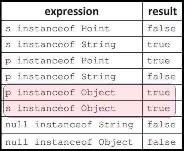

### Enlace dinámico
El enlace dinámico (Dynamic Binding o Late Binding) es el mecanismo por el cual Java decide en tiempo de ejecució (y no
en compilación) cuál versión de un método sobreescrito debe ejecutarse, basándose en el objeto real instanciado en 
memoria y no en el tipo de la variable que lo apunta.

1. En tiempo de compilación (Tipo estático): El compilador solo revisa la clase declarada a la izquierda (la 
referencia). Si el método no existe en esa clase, el código no compila.

2. En tiempo de ejecución (Tipo dinámico): Si el método sí existe en la clase padre y fue sobreescrito, la máquina 
virtual (JVM) busca la versión implementada por el objeto instanciado a la derecha.

Ahora bien, si una subclase agrega métodos propios y exclusivos que la clase padre no tiene, esos métodos quedan 
inaccesibles a través de una referencia de la clase padre.

```Java
class Animal {
    public void respirar() { ... }
}

class Perro extends Animal {
    public void ladrar() { ... } // Método exclusivo de Perro
}

// Tipo estático: Animal | Tipo dinámico: Perro
Animal a = new Perro(); 

a.respirar(); // Compila: 'respirar' existe en Animal
a.ladrar();   // ERROR DE COMPILACIÓN: 'ladrar' NO existe en el tipo estático Animal
```

Para solucionar esto, hacemos uso de un casteo explícito.

### Upcasting / Downcasting


#### Upcasting
EL Upcasting es tratar a un objeto de una clase hija como si fuera del tipo de una clase padre o superclase.
Este proceso es automático e implícito. Por ejemplo:

```Java
Dog miPerro = new Dog();
Mamifero m = miPerro; // Upcasting automático
Object obj = miPerro; // Upcasting automático
```

#### Downcasting
Forzar a una referencia de una clase padre a ser tratada como su clase hija específica para recuperar el acceso a sus 
métodos propios. Requiere casteo explícito con paréntesis. Por ejemplo:

```Java
Mamifero m = new Dog(); // La referencia es Mamifero, pero el objeto es Dog

// Downcasting explícito necesario para acceder a métodos de Dog:
Dog d = (Dog) m;
```

Considere el siguiente ejemplo:

```Java
// 1. Clase Padre
class Animal {
    public void respirar() {
        System.out.println("El animal está respirando");
    }
}

// 2. Clases Hijas con métodos propios
class Perro extends Animal {
    public void ladrar() {
        System.out.println("¡Guau guau!");
    }
}

class Gato extends Animal {
    public void maullar() {
        System.out.println("¡Miau miau!");
    }
}
```

Ahora su main:
```Java
public class Main {
    public static void main(String[] args) {
        // Upcasting implícito: la referencia es Animal, pero el objeto es Perro
        Animal miMascota = new Perro();

        // 1. Llamada permitida por el tipo estático (Animal)
        miMascota.respirar();

        // 2. Verificación de tipo antes de castear
        if (miMascota instanceof Perro) {
            Perro p = (Perro) miMascota; // Downcasting seguro
            p.ladrar();                  // Ahora sí podemos acceder al método propio
        }

        // 3. Demostración de protección contra errores:
        if (miMascota instanceof Gato) {
            Gato g = (Gato) miMascota; 
            g.maullar();
        } else {
            System.out.println("miMascota no es un Gato, se evitó un ClassCastException");
        }
    }
}
```

### Método getClass
El método getClass() (heredado de la clase universal Object) devuelve un objeto de tipo Class<?> que representa el tipo 
exacto de la clase con la que fue creado el objeto en tiempo de ejecución. Por ejemplo:

```Java
public class Main {
    public static void main(String[] args) {
        String texto1 = "Hola";
        String texto2 = "Mundo";
        Integer numero = 50;

        // Comparación directa 1:
        if (texto1.getClass() == texto2.getClass()) {
            System.out.println("texto1 y texto2 son de la misma clase (String)");
        }

        // Comparación directa 2:
        if (texto1.getClass() == numero.getClass()) {
            System.out.println("Son de la misma clase");
        } else {
            System.out.println("texto1 y numero son de clases diferentes");
        }
    }
}
```

### Objects.hash()
Objects.hash genera un código hash por la secuencia de valores enviados por parámetros. Por ejemplo:

```Java
int i = Objects.hash("one", 3, 'e');
System.out.println(i);

// Salida: 105915887
```

## Abstracción
### Clase Abstract
Representan un concepto base genérico o incompleto que no se puede instanciar directamente con new, sirviendo
exclusivamente como plantilla para que otras subclases la extiendan (extends). Representa una relación estricta de "es
un" (IS-A). Una subclase solo puede heredar de una única clase abstracta.

A priori, parecería que las clases abstractas, al no poder instanciarlas con la keyword **new**, no tuvieran
constructores. Sin embargo, Sí tienen constructores, de hecho, se invocan desde las clases hijas mediante super(...) 
para inicializar atributos heredados.

Existen también métodos abstractos, dichos métodos NO pueden tener código en su cuerpo. Justamente existen métodos
abstractos para que sus hijos hagan un override del método. **Todo método abstracto debe de estar en una clase** 
**abstracta pero no toda clase abstracta debe tener métodos abstractos**. **En una clase abstracta también pueden 
**existir métodos no abstractos**.

```Java
public abstract class Animal {
    protected String nombre;

    public Animal(String nombre) {
        this.nombre = nombre;
    }

    // Método concreto (lógica compartida con cualquiera que lo herede)
    public void dormir() {
        System.out.println(nombre + " está durmiendo...");
    }

    // Método abstracto (neccesario realizar un override para las subclases)
    public abstract void emitirSonido();
}
```

### Clase Inferface
Representan un contrato puro de comportamiento o capacidad ("puede hacer" / CAN-DO), independientemente de la jerarquía 
genealógica de la clase que lo implemente. Para decir que una clase "puede hacer" de una clase interface se usa 
la keyword **implements** en lugar de **extends**. Una clase puede implementar múltiples interfaces (implements Volador,
Nadador, Cloneable).

La clase Interface no tiene constructor alguno dado que **todos sus atributos son implícitamente public static final**
**(constantes globales)**. Sus métodos pueden ser de tipo:

- Abstractos (por defecto): Declarados sin cuerpo. Las clases que implementan la interfaz deben implementarlos.

- Métodos default (desde Java 8): Métodos con cuerpo para brindar una implementación por defecto sin romper clases 
existentes.

- Métodos static (desde Java 8): Métodos de utilidad que pertenecen a la interfaz.

- Métodos private (desde Java 9): Métodos auxiliares para reutilizar lógica interna entre métodos default.

```Java
public interface Volador {
    int ALTURA_MAXIMA = 10000; // public static final implícito

    void volar(); // public abstract implícito

    default void aterrizar() {
        System.out.println("Aterrizando de forma estándar...");
    }
}
```


# Manipulación de datos - Conceptos de flujos de entrada y salida
Para leer datos de una cierta fuente de datos, Java dispone de **InputStream** y
**OutputStream** . La entrada y salida (Input/Output) en java se basa en el concepto de
flujo (stream).

El flujo es una secuencia ordenada de datos que tiene una fuente (flujo de
entrada) o un destino (flujo de salida).

Existen 2 tipos de flujos:
- **InputStream**: leer datos de una fuente.
- **OutputStream**: escribir datos a un destino.

El manejo de los flujos se lo realiza a través de los paquetes **java.io** y **java.nio**.

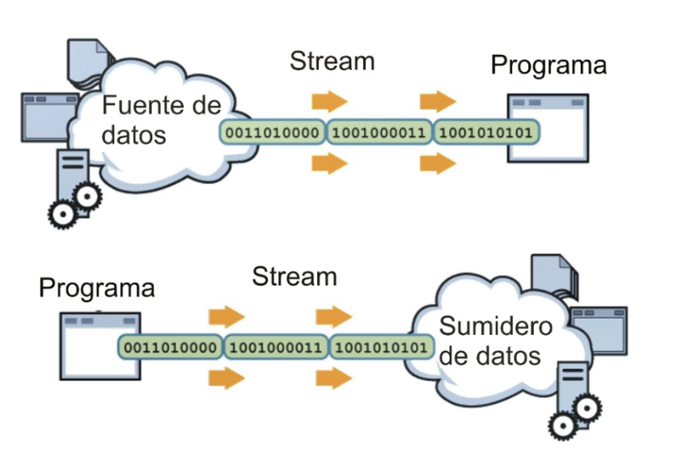

## Lectura y escritura de archivos
En Java, cada archivo es un flujo de bytes. Cada sistema operativo proporciona un
mecanismo para determinar el fin de un archivo. un programa en JAVA que procesa
un flujo de bytes recibe una notificación del sistema operativo cuando el programa
llega al fin del flujo.

Los flujos en la lectura o escritura de archivos funcionan igual independiente de la plataforma
de datos:
- Abrir el flujo de datos.
-  Mientras exista más información (leer o escribir ) los datos.
-  Cerrar el flujo de datos.

# Paquete io
## Paquete io (Lectura y escritura de archivos de texto)
### Clase Reader (Lectura)
La clase Reader es la clase abstracta de la cual heredan todas las clases concretas que se utilizan
para leer información en forma textual.

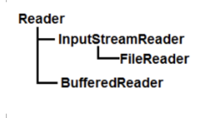

De reader, obtenemos:
- **InputStreamReader**: Clase que representa una conexión entre un stream de bytes y un stream de
caracteres.

- **FileReader**: clase para leer archivos de texto usando charset por defecto del sistema operativo.

- **BufferedReader**: lee el texto de un flujo de caracteres con eficacia (los caracteres se almacenan en
búfer para evitar la lectura frecuente del flujo subyacente) y proporciona un método conveniente para leer una línea de texto: **readLine()**.

#### Métodos de la clase Reader
- **read()**: lee un caracter.

- **read(char[])**: lee un arreglo de
caracteres.

- **skip(long)**: se salta algunos
caracteres.

- **close()**: cierra el flujo de datos.

### FileReader
FileReader es la librería que usamos para leer archivos de texto. Note que, la
declaración:
```Java
FileReader(String filePath)
FileReader(File fileObj)
```
Al tratar de leer un fichero, podría retornar una excepción **FileNotFoundException**. 
Por lo cual, optamos por un manejo de excepciones con try-catch.

#### Ejemplo
```Java
import java.io.FileReader;
import java.io.IOException;

public class TextFileReadingExample1 {
  public static void main(String[] args) {
    try {
      FileReader reader = new FileReader("MyFile.txt");
      int character;
      while ((character = reader.read()) != -1) {
        System.out.print((char) character);
      }
      reader.close();
    } catch (IOException e) {
      e.printStackTrace();
    }
  }
}
```

- **reader (FileReader)**: Representa el flujo del archivo "reader", mas no el fichero como tal.

### BufferedReader
A diferencia de FileReader, BufferedReader permite leer  texto
de un inputStream de una forma eficiente.

FileReader lee carácter por carácter pero BufferedReader lee bloques
de caracteres rápidamente.

```Java
BufferedReader(Reader in)
BufferedReader(Reader in, int sz)
```

Al tratar de leer un fichero, podría retornar una excepción **FileNotFoundException**. 
Por lo cual, optamos por un manejo de excepciones con try-catch.

#### Ejemplo 1
```Java
import java.io.FileReader;
import java.io.BufferedReader;
import java.io.IOException;

public class TextFileReadingExample3 {
  public static void main(String[] args) {
    try {
      FileReader in = new FileReader("MyFile.txt");
      BufferedReader bufferedReader = new BufferedReader(in);

      String line;

      while ((line = bufferedReader.readLine()) != null) {
        System.out.print(line);
      }

      bufferedReader.close();

    } catch (IOException e) {
      e.printStackTrace();
    }
  }
}
```

#### Ejemplo 2
```Java
import java.io.BufferedReader;
import java.io.FileReader;
import java.io.IOException;

public class LecturaTexto {

    public static void main(String[] args) {

        FileReader fr = null;
        BufferedReader br = null;

        try {
            System.out.println("--- Abriendo flujo de lectura ---");

            fr = new FileReader("notas.txt");
            br = new BufferedReader(fr);

            String linea;
            int contadorLineas = 0;

            while ((linea = br.readLine()) != null) {
                contadorLineas++;
                System.out.println("Linea " + contadorLineas + ": " + linea);
            }

        } catch (IOException e) {
            System.err.println("Error al procesar el archivo: " + e.getMessage());

        } finally {
            try {
                if (br != null)
                    br.close(); // .close() tiende a errores

                if (fr != null)
                    fr.close();

                System.out.println("--- Flujo cerrado de forma segura ---");

            } catch (IOException e) {
                e.printStackTrace();
            }
        }
    }
}
```

### Clase Writer (Escritura)
La clase Writer es la clase abstracta de la cual heredan todas las
clases concretas que se utilizan para escribir información en forma textual.

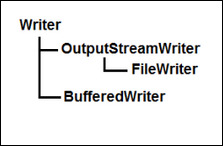

De Writer, obtenemos:
- **OutputStreamWriter**: Clase que representa una conexión entre un stream de bytes y un stream de
caracteres.

- **FileWriter**: clase para escribir archivos de texto usando charset por defecto del sistema operativo.

- **BufferedWriter**: Escribe el texto en un flujo de salida de caracteres, almacenando
caracteres en búfer para proporcionar una escritura eficiente de caracteres individuales, arreglos
y cadenas.


#### Métodos de la clase Writer
- **write(int)**: Escribe un caracter.

- **write(char[])**: escribe un arreglo de
caracteres.

- **write(String)**: escribe un string.

- **close()**: cierra el flujo de datos.

### FileWriter
FileWriter es la librería que usamos para escribir archivos de texto. Note que, la
declaración:

```Java
FileWriter(String filePath) 
FileWriter(String filePath, boolean append) 
FileWriter(File fileObj)
```

- **append**: El parámetro append se refiere a la forma de sobreescribir 
el documento: **true**: escribir lo nuevo al final; **false**: borrar todo (Sobrescribe).

Si el fichero en filePath no se ha creado, FileWreater crea
el fichero. Sin embargo, FileWriter puede retornar una excepción **FileNotFoundException**. 
Por lo cual, optamos por un manejo de excepciones con try-catch.

#### Ejemplo
```Java
import java.io.FileWriter;
import java.io.IOException;

public class TextFileWritingExample1 {
  public static void main(String[] args) {
    try {
      FileWriter writer = new FileWriter("MyFile.txt", true);
      writer.write("Hello World");
      writer.write("\r\n");   // write new line
      writer.write("Good Bye!");
      writer.close();

    } catch (IOException e) {
      e.printStackTrace();
    }
  }
}
```

### BufferedWriter
La diferencia entre BufferedWriter y FileWriter es equivalente a la diferencia
entre BufferedReader y FileReader. BufferedWriter escribe texto en el fichero
bloque por bloque (por lineas), mientras que FileWriter escribe carácter por carácter.

```Java
BufferedWriter(Writer out)
BufferedWriter(Writer out, int sz)
```

Note que BufferedWriter puede retornar una excepción.
Por lo cual, optamos por un manejo de excepciones con try-catch.

#### Ejemplo 1
```Java
import java.io.BufferedWriter;
import java.io.IOException;

public class TextFileWritingExample2 {
  public static void main(String[] args) {
    try {
      FileWriter out = new FileWriter("MyFile.txt", true);
      BufferedWriter bufferedWriter = new BufferedWriter(out);

      bufferedWriter.write("Hello World");
      bufferedWriter.newLine();   // write new line
      bufferedWriter.write("Good Bye!");

      BufferedWriter.close();

    } catch (IOException e) {
      e.printStackTrace();
    } finally {

    }
  }
}
```

#### Ejemplo 2
```Java
import java.io.BufferedWriter;
import java.io.FileWriter;
import java.io.IOException;

public class EscrituraTexto {

    public static void main(String[] args) {
        try (FileWriter fw = new FileWriter("bitacora.txt", true);
             BufferedWriter bw = new BufferedWriter(fw)) {

            System.out.println("Escribiendo datos en la bitácora...");

            bw.write("Puedo escribir los versos más tristes esta noche.\r\n" + //
                                "Se va con algo mío la tarde que se aleja;\r\n" + //
                                "mi dolor de vivir es un dolor de amar;\r\n" + //
                                "y al son de la garúa, en la antigua calleja,\r\n" + //
                                "me invade un infinito deseo de llorar.");
            bw.newLine();
            bw.newLine();
            
            bw.write("Que son cosas de niño, me dices; quién me diera\r\n" + //
                                "tener una perenne inconsciencia infantil;\r\n" + //
                                "mi dolor de vivir es un dolor de amar;\r\n" + //
                                "ser del reino del día y de la primavera,\r\n" + //
                                "del ruiseñor que canta y del alba de Abril.");
            bw.newLine();
            bw.newLine();
            
            bw.write("¡Ah, ser pueril, ser puro, ser canoro, ser suave;\r\n" + //
                                "trino, perfume o canto, crepúsculo o aurora\r\n" + //
                                "mi dolor de vivir es un dolor de amar;\r\n" + //
                                "como la flor que aroma la vida y no lo sabe,\r\n" + //
                                "como el astro que alumbra las noches y lo ignora!");
            bw.newLine();
            bw.newLine();

            bw.write("Estado: Excepciones y Archivos explicados con éxito.");
            bw.newLine();

            System.out.println("¡Escritura exitosa! Verifica el archivo 'bitacora.txt'.");

        } catch (IOException e) {
            System.err.println("Ocurrió un error en la escritura: " + e.getMessage());
        }
    }
}
```

## Paquete io (Lectura y escritura de archivos binarios)
Dado que ya sabemos cómo leer y escribir en un fichero de texto, procederemos
a modificar/leer archivos binarios. Las clases generales son **InputStream** y
**OutputStream**.

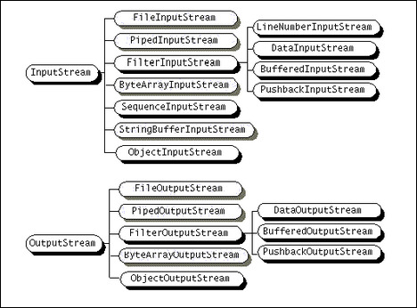

Con ficheros binarios nos referimos a imágenes, audio, video, etc...

### FileInputStream
FileInputStream es usada para leer datos binarios.

#### Ejemplo
```Java
import java.io.FileInputStream;  

public class DataStreamExample {  
  public static void main(String args[]){    
    try{    
      FileInputStream fin = new FileInputStream("D:\\fichero_bin.ddr"); 

      int i=0;    
      while((i = fin.read())!=-1){    
        System.out.print((char) i);    
      }    

      fin.close();    
    } catch(Exception e)
    {
      System.out.println(e);
    }    
  }    
}  
```

### FileOutputStream
FileOutputStream es usada para escribir datos binarios.

#### Ejemplo
```Java
import java.io.FileOutputStream;  

public class FileOutputStreamExample {  
  public static void main(String args[]){    
    try{    
      FileOutputStream fout = new FileOutputStream("D:\\fichero_bin.ddr");

      String s = "Esto es una prueba para ficheros binariosssss";    
      byte b[] = s.getBytes();  //converting string into byte array    

      fout.write(b);    
      fout.close();    
      System.out.println("success...");
          
      } catch(Exception e)
      {
        System.out.println(e);
      }    
  }    
}
```

# Paquete nio (Non-blocking)
Ya habiendo tratado el paquete io, es hora de introducir a su evolución, el paquete nio.
En el paquete java.io tradicional, cuando hacemos read() o write():

- El hilo del programa se detiene por completo.

- El programa se queda esperando pacientemente a que el disco duro lea los bytes.

- Si el disco es lento o el archivo es gigante, el programa no puede hacer nada
más mientras espera.

Por otro lado, nio permite operaciones E/S rápidas y escalables tomando ventaja de los
avances de E/S sin bloqueo en los sistemas operativos. Gracias 3 pilares fundamentales
Buffer, Channel y Selector.

Para el efecto, nio se basa en 3 clases (1 interfaz y 2 clases):

- **Interface Path**: Abstracción de un archivo o directorio dentro de un 
sistema de archivos.

- **Clase Paths**: Clase que retorna el directorio -> Paths.get(String first, String... more).

- **Clase Files**: Clase con los métodos ppara modificar sobre la ruta especificada.

## Clase Paths
Paths sirve para retornar el directorio limpio que apunta hacia un 
fichero.

### Ejemplo
```Java
// Estas dos llamadas son equivalentes 
Path hosts1 = Paths.get("/etc/hosts"); 
Path hosts2 = Paths.get("/etc", "hosts");

// Ejemplo
Path ruta = Paths.get("C:/usuarios/diego/documentos/archivo.txt");
```

Note que si llama a **Paths.get("/path1", ..., "pathn")** será equivalente a
**Paths.get("/path1/.../pathn")**.


## Clase Files
La clase Files contiene una gran variedad de métodos que nos permite:

- **Crear** archivos, carpetas y links simbólicos.

- **Copiar**, **mover** y **borrar**.

- **Consultar** atributos.

- **Iterar** sobre un árbol del sistema de archivos.

- **Obtener flujos** de lectura y escritura.

- **Realizar operaciones de escritura y lectura** directamente.

Siendo más específicos, los métodos son:

- **Files.readAllLines(Path path, Charset cs)**: Lee todas las líneas de un archivo.

- **Files.write(Path path, Iterable <? extends CharSequence > lines, Charset cs, OpenOption... options)**.

### Ejemplo 1
```Java
import java.io.IOException;
import java.nio.charset.Charset;
import java.nio.file.Files;
import java.nio.file.Path;
import java.nio.file.Paths;
import java.util.List;

public class Main {
  public static void main(String[] args) {
    Path wiki_path = Paths.get("C:/tutorial/wiki", "wiki.txt");

    Charset charset = Charset.forName("ISO-8859-1");
    try {
      List<String> lines = Files.readAllLines(wiki_path, charset);

      for (String line : lines) {
        System.out.println(line);
      }
    } catch (IOException e) {
      System.out.println(e);
    }

  }
}
```

Los **Charsets** más comunes que existen son:

- **ASCII**: Ocupa 7 bits y solo incluye el alfabeto inglés (sin tildes, sin ñ y sin ¿).

- **ISO-8859-1 (Latin-1)**: Una extensión de ASCII de 8 bits que agrega caracteres del español
y Europa occidental (como la ñ, á, é, ...).

- **UTF-8**: Estandar universal en la web, sistemas operativos y Java.

### Ejemplo 2
```Java
import java.io.IOException;
import java.nio.charset.Charset;
import java.nio.file.Files;
import java.nio.file.Path;
import java.nio.file.Paths;
import java.nio.file.StandardOpenOption;
import java.util.ArrayList;

public class Main {
  public static void main(String[] args) {
    Path myText_path = Paths.get("C:/tutorial/wiki", "wiki.txt");
    Charset charset = Charset.forName("UTF-8");

    ArrayList<String> lines = new ArrayList<>();

    lines.add("\n");
    lines.add("tutorial");

    try {
      Files.write(myText_path, lines, charset, StandardOpenOption.APPEND);
    } catch (IOException e) {
      System.err.println(e);
    }
  }
}
```

Los ENUMs con los que cuenta StandardOption son:

- **APPEND**: Si el archivo existe, escribe al final del contenido existente sin borrar nada de lo anterior.

- **CREATE**: Crea el archivo si no existe. Si el archivo ya existe, simplemente lo abre normalmente.

- **CREATE_NEW**: Crea un archivo nuevo, pero si el archivo ya existe, lanza una excepción.

- **TRUNCATE_EXISTING**: Si el archivo ya existe y se abre para escribir, borra todo su contenido.

- **DELETE_ON_CLOSE**: Borra el archivo en cuanto el programa lo cierra.

- **READ**: Abre el archivo únicamente para lectura.

- **WRITE**: Abre el archivo para escritura.

Es posible combinar estás opciones al llamar a Files.Write().

# Serialización y deserialización de objetos
La Serialización es el proceso de tomar un objeto vivo en la memoria RAM y "aplanarlo" o convertirlo en una secuencia de 
bytes.

Ésto es útil ya que los objetos en la memoria RAM desaparecen al apagar o cerrar la aplicación. Al convertir un objeto a 
una secuencia de bytes, es posible:

- Guardarlo en el disco duro (en un archivo .dat o .ser) para recuperarlo después.

- Enviarlo a través de la red a otro programa, servidor o base de datos.

Cabe recalcar que las variables estáticas, dado que pertenecen a la clase en general y no a un objeto en particular, **no se pueden guardar al serializar**.

## Interfaz Serializable
Un objeto se puede serializar si implementa el interface Serializable. la interface no declara ninguna función miembro, se trata de un interface vacío.

### Ejemplo
```Java
import java.io.Serializable

public class Student implements Serializable {
  int id;
  String name;
  
  public Student(int id, String name) {
    this.id = id;
    this.name = name;
  }
}
```

## Clase ObjectOutputStream
Es usada para escribir los datos primitivos y objetos a un OutputStream (Serialización). Sólo objetos que implementan Serializable pueden ser escritos a streams.

la sintaxis del constructor de ObjectOutputStream es la siguiente:

```Java
public ObjectOutputStream(OutputStream out);

// El constuctor puede lanzar una IOException
public ObjectOutputStream(OutputStream out) throws IOException {}
```

**throws IOException** implica que, si al llamar al constructor algo sale mal, éste lanza una excepción que siempre se tendrá que controlar con un try-catch.

Para escribir objetos en un fichero binario en Java se utiliza la clase ObjectOutputStream derivada de OutputStream.
Un objeto ObjectOutputStream se crea a partir de un objeto Dile OutputStream asociado al fichero. Así:

```Java
FileOutputStream fout = new FileOutputStream("f.ser"); // Capa 1: Apunta a un archivo

ObjectOutputStream out = New ObjectOutputStream(fout); // Capa 2: Sabe convertir objetos a bytes
```

FileOutputStream sólo sabe escribir bytes en un archivo (No sabe si es específicamente un objeto on fichero de bytes cualquiera). ObjectOutputStream es una capa envolvente que sí sabe traducir un objeto Java a Bytes, y luego usa el FileOutputStream de adentro para realmente escribirlos al disco.


### Métodos
- **writeObject(Object obj)**: Escribe el objeto específicado en el flujo de salida.

- **flush()**: "Descarga" el flujo de salida actual.

- **close()**: Cierra el flujo de salida.


#### Ejemplo
```Java
impot java.io.*

class Persiste {
  public static void main(String args[]) throws Exception {
    Student s1 = new Student(211, "ravi");

    FileOutputStream fout = new FileOutputStream("f.ser");
    ObjectOutputStream out = new ObjectOutputStream(fout);

    out.writeObject(s1);
    out.flush();
  }
}
```

## Clase ObjectInputStream
Es usada para leer los objetos contenidos en un fichero binario que ha sido almacenado
previamente por un **ObjectOutputStream** -> De igual forma que con **ObjectOutputStream**, **ObjectInputStream**
depende de un **ObjectOutputStream**.

la sintaxis del constructor de ObjectOutputStream es la siguiente:

```Java
ObjectInputStream(InputStream nombre);
```

El constructor puede **lanzar una IOException**.

### Métodos
- **readbject(Object obj)**: Devuelve el objeto del fichero (tipo Object).

- Es necesario hacer un casting para guardarlo en una variable del tipo adecuado.

- **close()**: Cierra el flujo de entrada.

#### Ejemplo
```Java
import java.io.*;
class Depersist{
   public static void main(String args[])throws Exception{
     ObjectInputStream in=new ObjectInputStream(new FileInputStream("f.txt"));
     Student s=(Student)in.readObject();

     System.out.println(s.id+" "+s.name);
     in.close();
  }
}
```

Note que, no es necesario que f.txt sea f.ser. De hecho, Java no valida la extensión del archivo;
Lo que a FileInputStream y ObjectInputStream les importa es que los bytes binarios
guardados dentro del archivo coincidan con la estructura del objeto serializado. Sin embargo, lo
**ideal** en **código limpio** es usar f.ser o f.dat.

En resumen:
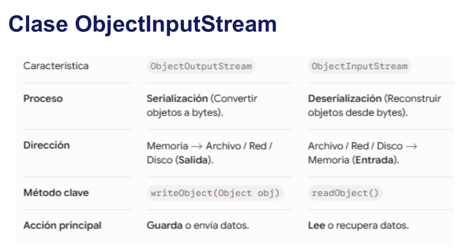

Cada archivo al ser seralizado guarda la **versión UID** actual de la clase. Así, cuando leamos
el objeto serializado con **ObjectInputStream**, java va a comprar la versión UID actual de la clase
con la versión UID que se guardó el archivo serializado. Si los UID no coinciden, Java retornará
**InvalidClassException**.

Podemos establecer "manualmente" la versión UID de la clase:

```Java
private static final long serialVersionUID = 8799656478674716638L;
```

### Modificador transient
Si al serializar el objeto, deseamos que NO se guarde el tipo de dato de una variable
específica, usamos la keyword especial **transient**.

```Java
public class Usuario implements Serializable {	
 private String nombre;
 private transient String password;
}
```

- Si una clase implementa Serializable, todas sus subclases se podrán serializar también.
- Si una clase tiene referencia a otra clase, esta debe ser serializable o el proceso no podrá realizarse.
- Los miembros estáticos de la clase no se serializan (campos, atributos, métodos).


# Tipo y manejo de excepciones
Las excepciones son un mecanismo de control de errores en tiempo de ejecución. Así, podemos
hacer que una aplicación continúe su ejecución si se produce un error. 

En JAVA cuando se detecta un error, se crea un objeto de una clase especial (clase Exception), el cual incluye toda la información del problema, tal como el punto del programa donde se produjo, la causa del error, etc.

Ahora bien, si se da una excepción, el objeto problemático hace un **throw**, con la esperanza de que alguien lo atrape y decida como recuperarse del error. Si nadie lo atrapa, el programa termina, y en la consola de ejecución aparecerá toda la información contenida en el objeto que representaba el error.

- **throw**: Estado en que el objeto lanza el error(excepción) que puede generar para que alguien atrape ese error
y pueda solucionarlo, de tal forma que no se detenga la ejecución total del programa.

## Tipos de excepciones

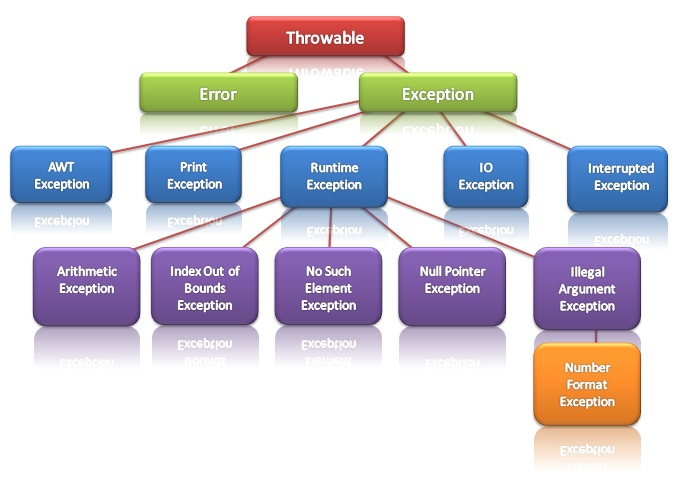

- Error: Se refiere a errores graves en la máquina virtual de Java, como por ejemplo fallos al enlazar con alguna librería. 

- Exception: Representa errores que no son críticos y por lo tanto pueden ser tratados y continuar la ejecución de la aplicación.

Existen 2 tipos de excepciones:

1. Checked: Se revisan en tiempo de compilación. Todas las que heredan de Exception menos RuntimeException.

2. Unchecked: No se revisan en tiempo de compilación sino en tiempo de ejecución (Clases que heredan de
 RuntimeException).

## Manejo de excepciones
Ahora que ya vimos qué es una excepción, procedemos a explicar de qué formas disponemos para atrapar dichos
errores y continuar con la correcta ejecución de nuestro programa.

### Anunciar que una excepción se puede producir (throws exception)
Cuando un método desea disparar una excepción, se debe indicar como parte de la signatura de
método usando la clausula throws.

```Java
public void afiliarSocio( String pCedula, String pNombre, Tipo pTipo ) throws Exception
{
  // Code
}
```

### Bloque try-catch
Con el bloque try-catch podemos manejar de forma correcta la excepción

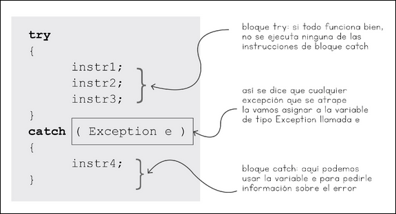

- Try: delimitar la porción de código dentro de un método en el que necesitamos desviar el control si una excepción ocurre allí. 

- Catch: definir el código que manejará el error o atrapará la excepción.

Por ejemplo:

```Java
try{
    int a = 5 / 0;
}catch(ArithmeticException err){
    int a = 0;
}
catch(exception e){
    System.out.println("Ocurrió un error inesperado");
}
```

Con este ejemplo es claro que el código dentro del try puede generar más de una excepción, y se pueden capturar 
todas ellas. De hecho:

```Java
try { //Código que puede provocar el error } 

catch(IOException ioe) { //Código para tratar la IOException } 

catch(Exception e) { //Código para tratar la Exception }
```

Es fácil ver que Los catch deben capturar las excepciones más concretas en primer lugar, y las más generales al final.
Caso contrario, nunca llegaremos a las excepciones concretas.

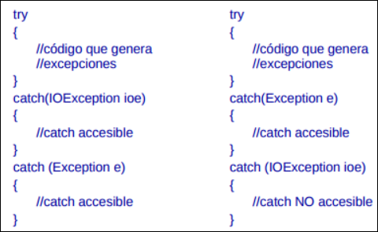

#### Bloque finally
Finally se utiliza cuando el programador solicita ciertos recursos al sistema que se deben liberar. Se coloca
después del último bloque catch o luego del bloque try. Por ejemplo: 

```Java
FileReader lector = null;

try {
    lector = new FileReader("archivo.txt");
    int i=0;
    while(i != -1){
        i = lector.read();
        System.out.println((char) i );
    }
} catch (IOException e) {
    System.out.println("Error");
} finally {
    if(lector != null){
            lector.close();
    }
}
```

### Try-with-resources
Es una estructura introducida en Java 7 que permite declarar recursos dentro de los paréntesis del try (...) para que 
Java los cierre automáticamente al terminar el bloque, sin necesidad de escribir un finally manual.

Cabe aclarar que, un recurso es cualquier objeto que maneja conexiones externas del sistema operativo (archivos, sockets 
de red, conexiones a bases de datos, Scanner, flujos de entrada/salida) y que debe cerrarse obligatoriamente para no 
dejar fugas de memoria (resource leaks).

Sólo Objetos que implementan java.lang.AutoCloseable pueden ser usados como recursos. Por ejemplo:

```Java
import java.io.BufferedReader;
import java.io.FileReader;
import java.io.IOException;

public class ReadFileExample2 {
	private static final String FILENAME = "E:\\test\\filename.txt";

	public static void main(String[] args) {
		try (BufferedReader br = new BufferedReader(new FileReader(FILENAME))) {
			String sCurrentLine;
			while ((sCurrentLine = br.readLine()) != null) {
				System.out.println(sCurrentLine);
			}
		} catch (IOException e) {
			e.printStackTrace();
		}
	}
  
}
```


# Programación concurrente
## Concurrencia y Paralelismo
**La concurrencia** es la capacidad de una aplicación o sistema para estructurarse de modo que múltiples 
tareas progresen en un mismo intervalo de tiempo, alternando entre ellas. **Funcionamiento**: 
La CPU ejecuta un pedazo de la **Task 1**, luego salta a la **Task 2**, luego vuelve a la 
**Task 1**, y así sucesivamente tan rápido que da la ilusión de que ocurren al mismo tiempo. **Puede ocurrir en un sólo núcleo/procesado**.

Por ejemplo: realizar otra tarea mientras se realiza lectura o escritura en el disco.

**El paralelismo** es la ejecución física y literalmente simultánea de dos o más tareas en el mismo instante exacto de tiempo. **Funcionamiento**: Task 1 se ejecuta de inicio a fin en el Núcleo 1, mientras que Task 2 se ejecuta de forma independiente y al mismo tiempo en el Núcleo 2. **solo es posible en sistemas multinúcleo, multiprocesador o distribuidos**.

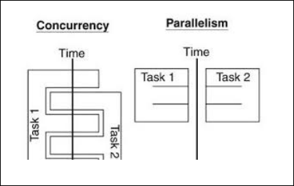


## Hilos (Teoría)
Un hilo es la unidad básica más pequeña de procesamiento que el sistema operativo puede planificar y ejecutar en la CPU:

- Lista secuencial de instrucciones: Es un camino único de código que se ejecuta paso a paso (línea 1, luego línea 2, luego línea 3).

- El hilo principal (main): Todo programa en Java arranca por defecto con al menos un hilo, el hilo main. Cuando ejecutas tu aplicación, la CPU sigue esa lista de instrucciones de arriba hacia abajo.

De esta forma, si tenemos un programa de un solo hilo: **Tendríamos tareas bloqueantes, es decir, si la tarea N tarda 10 segundos leyendo un archivo en disco, el hilo se congela esperando**.


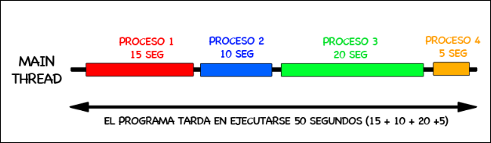

### Multihilos
Es la capacidad de mantener varios hilos de ejecución. De esta forma, ya no se daría que una tarea A se ejecute, bloqueando a otra tarea B posterior a tarea A.


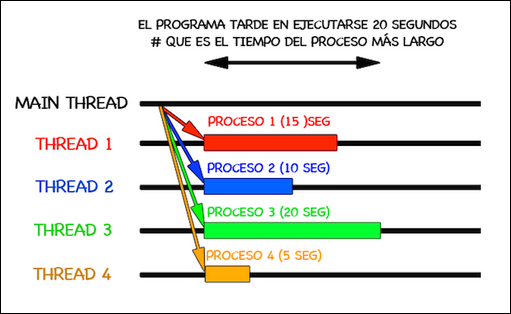

En programación paralela se crean tantos hijos como núcleos diferentes dispone el sistema
y se divide entre ellos la tarea que deseamos realizar.

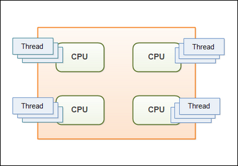


## Hilos (Java)
La **clase Thread** en Java es aquella clase que encapsula todo el control necesario sobre los hilos 
de ejecución(Threads). Thread se encuentra en el paquete java.lang. la clase **Thread** implementa la 
interdaz Runnable.

### Atributos de la clase Thread

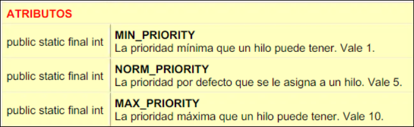

### Constructores de la clase Thread

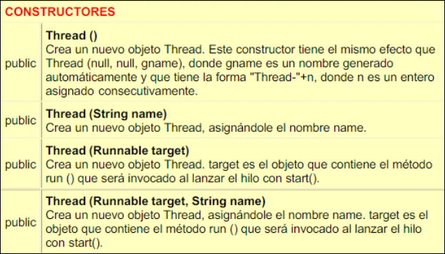

**Runnable**: Es simplemente una interfaz estándar de Java cuya única misión es contener la tarea o el bloque de código que quieres que un hilo ejecute.

### ¿Cuál es la diferencia entre “Extends Thread” y “Implements Runnable”?
- **Extender Thread**: tu clase ES un hilo ("is-a Thread"). Literalmente heredas todo el comportamiento de Thread y le
agregas tu lógica sobreescribiendo run().

- **Implementar Runnable**: tu clase TIENE una tarea que se puede ejecutar ("has-a task"), pero no es un hilo en sí
misma. Es solo un objeto con un método run(); necesitas un Thread aparte para realmente ejecutarla.

### Ejemplo
#### Extends Thread
```Java
public class Main {
    public static void main(String[] args) {
        // Uso:
        Tarea tarea1 = new Tarea();
        tarea1.start(); // El objeto MISMO es el hilo

        // (Opcional) Puedes crear un segundo hilo para ver cómo intercalan:
        // Tarea tarea2 = new Tarea();
        // tarea2.start();
    }
}

class Tarea extends Thread {
    @Override
    public void run() {
        for (int i = 1; i <= 500; i++) {
            System.out.println(getName() + " : " + i); // getName(): Obtener nombre del núcleo
        }
    }
}
```

#### Extends Runnable
```Java
public class Main {
    public static void main(String[] args) {
        // Uso:
        Tarea2 tarea1 = new Tarea2();
        Thread t1 = new Thread(tarea1); // el objeto es solo la TAREA
        t1.start();                      // el hilo real es t1
    }
}

class Tarea2 implements Runnable {
    @Override
    public void run() {
        for (int i = 1; i <= 50; i++) {
            System.out.println(i);
        }
    }
}
```

### Estados de un hilo 

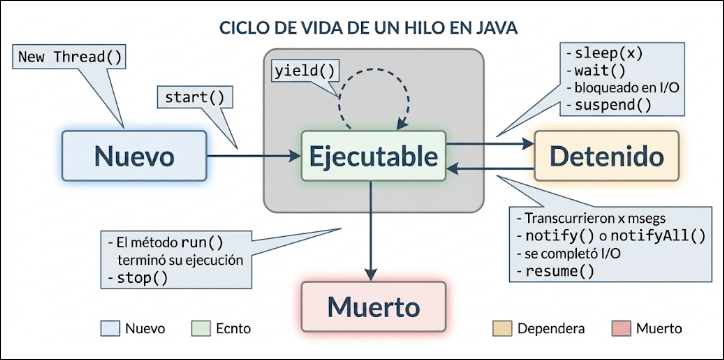

#### Estado New
Al instanciar el objeto con new Thread(), el objeto existe en la memoria RAM (Heap), pero todavía no es
un hilo activo en el sistema operativo ni consume tiempo de CPU.

```Java
Thread t = new Thread(() -> {
    System.out.println("Ejecutando");
});

// El hilo aún no se ha lanzado
System.out.println(t.getState()); 
// Salida: NEW
```

**.getState()**: Retorna el estado del hilo.

#### Estado Ejecutable/Runnable
Al llamar a start(), la JVM crea el hilo real del sistema operativo y lo coloca en la cola de listos. A partir de aquí, el hilo compite por tiempo de CPU junto con los demás hilos activos.

```Java
t.start();
System.out.println(t.getState());
// Salida: RUNNABLE
// (puede alternar entre "listo" y
//  "corriendo" sin que Java lo distinga)
```

#### Estado Running
Ocurre cuando el planificador le asigna al hilo un intervalo real de CPU (quantum). El hilo procesa instrucciones hasta
que ocurra alguno de estos tres eventos:

- Se acaba su tiempo: El sistema operativo le retira la CPU y vuelve a RUNNABLE (listo), esperando su próximo turno.

- Termina su trabajo: El método run() finaliza por completo → pasa a TERMINATED (muerto).

- Alguien lo detiene: Uso de stop() — método obsoleto y peligroso, puede dejar objetos en estado inconsistente.


```Java
// Ejemplo: perder la CPU no interrumpe el bucle, solo pausa su avance
public void run() {
    for (int i = 1; i <= 500; i++) System.out.println(getName() + " : " + i);
} // Al llegar aquí (fin del for), el hilo pasa de RUNNING a TERMINATED
```

#### Estado Sleep (Dormido)
Se activa al invocar **Thread.sleep(millis)**. El hilo no consume CPU durante ese tiempo — no es candidato a que se le
asigne el procesador hasta que se cumpla el plazo.

```Java
public void run() {
    for (int i = 1; i <= 5; i++) {
        System.out.println(getName() + ": " + i);
        try {
            Thread.sleep(3000); // milisegundos
        } catch (InterruptedException e) {
            e.printStackTrace();
        }
    }
}
```

#### Estado bloqueado (Blocked)
En el diagrama clásico se asocia solo a la espera de E/S, pero en la API real de Java, BLOCKED tiene un significado más
preciso: un hilo está bloqueado cuando espera entrar a una sección synchronized que otro hilo ya tiene bloqueada
(su"candado" o lock).

```Java
Object candado = new Object();

public void run() {
    synchronized (candado) {
        // si otro hilo ya está aquí dentro,
        // este hilo queda BLOCKED hasta
        // que el candado quede libre
        procesarDatos();
    }
}
```

Es decir, que si 2 mismos hilos (Hilo A, Hilo B) se crean con un mismo Runnable y, si Hilo B intenta entrar al bloque synchronized mientras Hilo A todavía está adentro, decimos que Hilo B está en estado bloqueado.


#### Estado Suspendido
```Java
private volatile boolean pausado = false;
private final Object monitor = new Object();

public void run() {
    while (activo) {
        synchronized (monitor) {
            // Si está pausado, entra a wait() y LIBERA el monitor
            while (pausado) {
                try {
                    monitor.wait(); // Pausa el hilo de forma segura
                } catch (InterruptedException e) {
                    Thread.currentThread().interrupt();
                }
            }
        }
        // ... trabajo normal del hilo ...
    }
}
// pausar():  pausado = true;
// reanudar(): synchronized(monitor){ pausado=false; monitor.notify(); }
```


