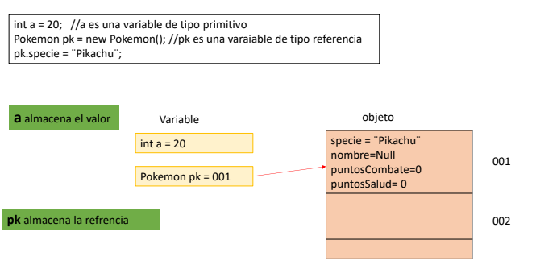
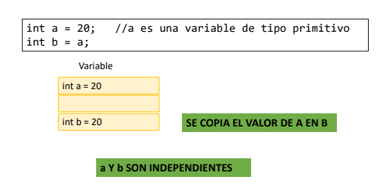
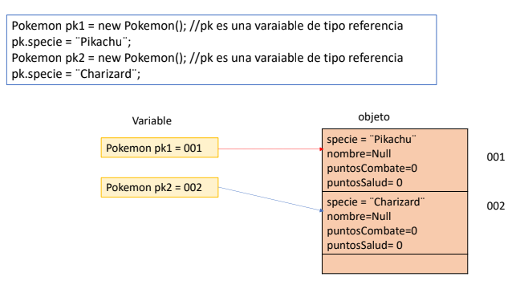
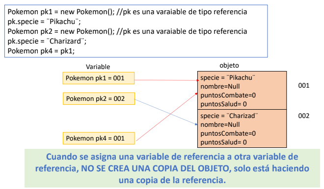
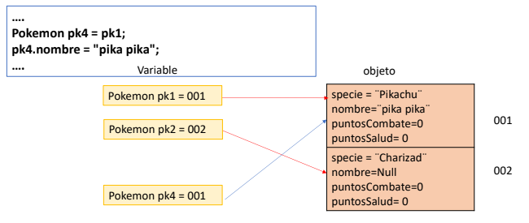
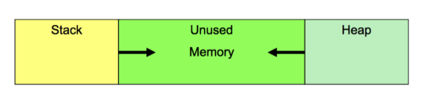
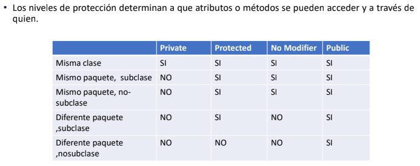
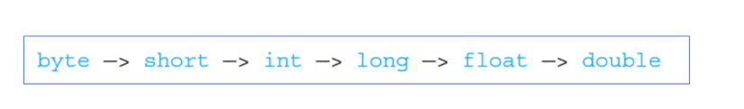

# Programación Orientada a Objetos
## Bases de POO
Luego de haber aprendido la programación estructural en fundamentos
de programación, es hora de explorar de las diferentes formas que disponemos
para resolver un problema, que no sea solo resolver el problema descomponiéndolo
y resolver pequeñas partes de ese problema.

Es aquí donde entra el paradigma (Forma de ver un problema) de la programación orientada
a objetos. En el paradigma de la programación orientada a objetos, no descomponemos 
el problema en problemas más pequeños, mas bien, lo descomponemos en objetos del mundo real.

### Objeto
Es la representación abstracta de una entidad o de un concepto. También se lo asocia 
con un elemento del problema.

Los objetos poseen **estados** y **comportamientos**:
- Estados: Valores de sus propiedades (atributos = propiedades).
- Comportamientos: Acciones que puede realizar el objeto (métodos).

### Clase
Una clase es un plano o mapa que define cuáles son los atributos y métodos
que un objeto tendrá. También se la conoce como **unidad básica** en POO.

- 

Entonces, cada clase define la plantilla de cómo se verá el objeto. El objeto, es, en realidad, la instancia de la plantilla o clase. De esta forma, cada objeto es independiente
y tiene su propio estado.

### Pilares fundamentales de la programación Orientada a Objetos
#### Abstracción
Consiste en aislar los elementos esenciales de un objeto para crear su "molde" (clase), 
ocultando los detalles que no son relevantes para el sistema (Pero sí para la clase).

 - Piensa en un automóvil. Para conducirlo, solo necesitas interactuar con el volante, los pedales y la palanca de cambios. No necesitas saber exactamente cómo calcula la computadora la inyección de combustible o cómo funciona internamente el motor.

#### Encapsulamiento
Es la acción de reunir los datos (atributos) y los comportamientos (métodos) dentro de una
misma estructura (la clase), y restringir el acceso directo a ellos desde el exterior
(Ésto se logra con las keyWords public, private, default, ...).

 - Piensa en una cápsula de medicina. Los compuestos químicos están guardados dentro para protegerlos y evitar que se alteren.

#### Herencia
Permite crear nuevas clases a partir de clases ya existentes. La nueva clase (clase hija) "hereda" los atributos y métodos de la clase original (clase padre), lo que evita tener que reescribir código y permite extender sus funciones.

 - Piensa en una clase padre llamada Vehiculo (con atributos como marca y modelo), puedes crear clases hijas como Auto, Moto o Camion. Todas ellas comparten las características de un vehículo, pero cada una puede tener sus propios detalles particulares (como numeroDePuertas en el auto).

#### Polimorfismo 
Es la capacidad de que un mismo método o instrucción se comporte de manera diferente según el objeto que lo esté ejecutando.

Ahora bien, necesitamos un lenguaje para poder aplicar este  paradigma. Por lo que
procederemos a aprender sobre Java.

## Introducción a Java
Java es un lenguaje de alto nivel, multiplataforma y orientado a objetos. 
Lo primero que estudiaremos serán los tipos de datos.

### Tipos de datos 
Un tipo de dato es la especificación de un dominio (rango de valores) de un conjunto válido. En Java existen 8 tipos de datos, llamados primitivos.

#### Datos primitivos

Tipos de datos *Numéricos*:
- Byte: valor entero que pertenece al intervalo [-128, 127].

- Short: valor entero que pertenece al intervalo [-32768, 32767].

- Int: valor entero que pertenece al intervalo [-2147483648, 2147483647].

- long: valor entero que pertenece al intervalo [-9223372036854775808, 9223372036854775807].

Tipos de datos *Numéricos flotantes*:
- Float: flotante que pertenece al intervalo de [1.4 x 10-45, 3.4 x 1038].

- Double: flotante que pertenece al intervalo de [4.9 x 10-324, 1.8 x 10308].

Tipos de datos *caracter*:
- Char: Almacena exactamente un caracter.

- Boolean: Valores de verdadero o falso (Lógica proposicional).

#### Datos no primitivos (Objetos)
- String: Conjunto de datos tipo Char (Cadenas de texto).

- Scanner: Leer entrada de datos por teclado.

- Arraylist: Creación de arreglos dinámicos.

### Operadores en Java
Existen 5 tipos de operadores en Java.

#### Operadores ariméticos
|Operador      |Símbolo       |
|--------------|--------------|
|     ++     |Operador de incremento, utilizado para incrementar el valor en 1.|
|     --     |Operador de decremento , usado para disminuir el valor en 1.|

- *Pre-(Incremento/Decremento)*: El valor se incrementa/decrementa primero
y luego se calcula el resultado.

- *Post-(Incremento/Decremento)*: el valor se usa por primera vez para calcular
el resultado y luego se incrementa /decrementa.

- Ejemplo de expresiones: ++a, a++, --a, --a.

#### Operadores Unarios
Los operadores Unarios sólo necesitan un operando.

|Operador      |Descripción       |
|--------------|--------------|
| ==             |    Es igual     |
| !=            |    Es distinto     |
| <   |    Menor     |
| <=         | Menor o igual        |
| >  | Mayor       |
| >= | Mayor o igual        |
| &&         |     Operador Conjunción   |
| Or (Dos barras verticales) | Operador disyunción inclusiva       |
| ! | Operador negación        |

### Comentarios en el código
#### Código de una sola línea
```Java
// Éste es un comentario de una sola línea
```

#### Código multilínea 
```Java
/* Ejemplo de comentarios
*Este es un comentario multilínea
*/
```

### Sobre escribir como en python (De la nada)
Primero que todo, en Java, **Nada puede existir fuera de una clase**. Todas las variables
(atributos) y funciones (métodos) deben de estar en una clase, de lo contrario, no existe
y el fichero no se podría compilar. Esto es debido a que java es un lenguaje orientado a 
objetos (Todo existe solo con una clase y nada existe sin una).

### Sobre cómo crear una plantilla (Clase)
La estructura para crear una clase siempre será la siguiente:
```Java
visibilidad class NombreDeClase{
  // code
}
```
Por ejemplo:
```Java
public class Estudiante {
  // code
}
```

El nombre de la clase siempre irá en **PascalCase**. Siempre y cuando **exista una clase
con visibilidad pública, las demás deberán de ser del tipo default**.

#### Tipos de visibilidades
Cómo las demas clases ven a una clase.
- Public: Lo ve cualquier clase del proyecto (Cualquier carpeta).
- Protected: Lo ven las clases de la misma carpeta y sus subclases (Herencia).
- Default: Solo lo ven las clases que comparten la misma carpeta.
- Private: Solo lo ve la misma clase que lo contiene entre sus llaves.

Aunque en la práctica no es "sólo ver" la clase sino mas bien instanciarla.

### Sobre clases privadas
Existen clases privadas tanto dentro de la clase pública como dentro de una clase con visibilidad por defecto. No existen clases privadas fuera de la clase pública (No tendría sentido ocultarse de nadie).


### Cómo crear clases
Con esto podemos escribir el siguiente código y note que, a priori, no daría error.
```Java
// Nombre archivo: carro.java 
// Así, no es necesario que tengan el mismo nombre de la clase
// Visibilidad por defecto

class Vehicle {
  String color;
  int power;
  int seats;
}
```

```Java
// Nombre archivo: Vehicle.java
// Si es public, debe llamarse como el fichero
public class Vehicle {
  String color;
  int power;
  int seats;
}
```

En ambos casos, si lo llegase a compilar y a ejectuar, le saldría el mensaje de que 
efectivamente existe la plantilla pero no tiene un método Main (Nada a ejecutar).

### Método Main
Podrías verlo como el botón de encendido de la clase. Es lo primero que Java busca
a toda velocidad en una clase. Éste indica desde dónde se iniciará el programa.

```Java
public static void main(String[] args)
```

Cabe aclarar que éste método **siempre** es público.

#### Ejemplo práctico de una clase
```Java
// Nombre archivo: Main.java

class Estudiante {
  String nombre;
  static String universidad = "ESPOL";
}
 
public class Main {
  public static void main(String[] args) {
    Estudiante e1 = new Estudiante();
    Estudiante e2 = new Estudiante();

    e1.nombre = "Carlos";
    e2.nombre = "Ana";

    System.out.println(e1.nombre);
    System.out.println(e2.nombre);

  // ambos comparten universidad
    System.out.println(Estudiante.universidad);
  }
}
```

### Declaración de variables
La estructura para delcarar una variable es la siguiente:
```Java
// nombre archivo: Main.java
public class Main {
  modificadorTipo nombreVariable; // el nombre va en camelCase
}
```

#### Tipos de modificadores en variables (Igual que en las clases)
- Private: Sólo la misma clase puede acceder a ella (dentro de sus respectivos {}).
- Default: Sólo lo ven las clases que comparten la misma carpeta.
- Protected: Lo mismo que el default inclyendo a las subclases.
- Public: Vista general, todos pueden ver la variable y manipularla.

### Declaración de métodos
Los métodos son simplemente las funciones que existen dentro de una clase, que
pertenecen a un objeto en particular. Solemos decir que los métodos de un objeto
son las acciones que puede realizar.

La estructura para delcarar un método es la siguiente:
```Java
// nombre archivo: Main.java
public class Main {
  // code

  modificador tipo nombreMetodo(parameter-list) {
    // code

    return variableDeTipotipo;
  }
}
```

#### Firma de un método
La firma de un método es cómo Java ve al método al momento
de guardar espacio en la memoria. Por ejemplo:

```Java
public int acelerar(int velocidadInicial, String tipoTerreno) {
    // Lógica aquí...
    return 100;
}
```

Su firma es: acelerar(int, String)

#### Tipos de datos de un método 
Con el **tipo** nos referimos al dato que retornará la función. Por ejemplo,
si quisieramos sumar números, entonces la función tendría que retornar un número
(entero o decimal), también pueden retornar objetos. Pueden haber casos en los 
que queremos que una función no retorne nada, por lo que usamos la keyword **void**.

### Ubicación del proyecto Java en código (package)
Al momento de crear un archivo Java, con el propósito de desarrollar una solución, es recomendable
trabajar esa solución como un proyecto. Ahora bien, la sintaxis para indicarle a Java el
"proyecto" en el que "vive el fichero .java" es la siguiente:

```Java
package nombreDeLaCarpetaDelProyecto 

// nombre archivo: Main.java
public class Main {
  // code
}
```

Aunque más bien le estamos diciendo en que carpeta vive el fichero Java.

Si el fichero Java está dentro de la carpeta general, entonces:
```Java
package carpetaGeneral.carpetaHija
// "Oye, tú vives en la carpeta carpetaHija, que a su vez está dentro de la carpetaGeneral

// nombre archivo: Main.java
public class Main {
  // code
}
```

### Llamar a código externo (import)
Si queremos usar código que está en otra carpeta (diferente paquete), usamos
la keyword reservada **import**, de esta forma:

```Java
package ubicacionPaquete

import carpetaPadre.carpetaHija.ficheroJava

// nombre archivo: Main.java
public class Main {
  // code
}
```


### Creación de objetos en Java
Dado que ya tenemos el lugar para escribir código, veamos cómo podemos
crear objetos (instanciar clases). La sintaxis es la siguiente: 

```Java
package nombreDeLaCarpetaDelProyecto 

// nombre archivo: Main.java
public class Main {
  // CrearObjeto
  Type nombre_variable = new Type();
}
```

Así, hacemos uso de la keyword reservada **new**.

### Acceder a las propiedades y métodos de un objeto
Lo más común en el paradigma de la programación orientada a objetos es acceder a
éstos y modificar sus atributos o comportamientos. Nos valemos de la siguiente sintaxis ".":

```Java
package nombreDeLaCarpetaDelProyecto 

// nombre archivo: Main.java
public class Main {
  // CrearObjeto
  Type nombre_variable = new Type();

  nombre_variable.nombreMetodo();
  nombre_variable.nombreAtributo;
}
```

### Valor vs Referencia
Los tipos de datos que encontramos en Java son de 2 tipos: primitivos y de
referencia. 

- **Datos primitivos**: boolean, byte, char, short, int, long, float y double.

- **De referencia**: Todos aquellos que no son primitivos, de hecho, estos tipos 
de datos suelen estar compuestos de datos primitivos (Como Strings).

Java tiene diferentes formas de almacenar los datos dependiendo de su tipo. De hecho, 
las variables de **tipo primitivo almacenan el valor** mientras que las variables de
**tipo clase almacenan la referencia**.

Por ejemplo:



Podría verlo como que el dato solo existe en un lugar de la memoria. Por otro lado, un objeto
es más bien una referencia en la memoria, Java sólo ve hacia donde apunta ese objeto.

De hecho, sea a = 20 y b = a. Entonces, para java, la situación es la siguiente:



En cambio, si creamos objetos, éstos no solamente existen. Los objetos al crarse
apuntan a un lugar de la memoria (Su referencia). Por ejemplo:



Note que si: Pokemon pk4 = pk1; pk4 apuntará a la referencia de un objeto ya creado:



Dado que ambos objetos tienen mismas referencias, al cambiar un atributo de pk4
o pk1, estamos afectando a ambos objetos. De hecho:



### Variables de Instancia vs Variables Locales
#### Variables locales
- Es una variable declarada dentro de la definición de un método o función.

- Deben ser inicializadas antes de ser utilizadas (No puede haber un int numeroSuerte; sino int numeroSuerte = 1;)

#### Variables de Instancia
- Es la variable definida para todas las intancias de una clase (Estado del objeto).

- Toman un valor predeterminado si no son inicializadas.

#### Valor predeterminado para variables de instancia
- **Objetos** -> null

- **int, byte, long** -> 0

- **double, float** -> 0.0

- **char** -> ''

- **boolean** -> false

### Tipo de dato null
Es un valor espacial que se puede asignar a cualquier tipo de referencia. Se usa
para indicar que una variable de referencia **no apunta a un objeto aún**.

Por lo tanto, no es posible int a = null; porque int no es un tipo de dato de referencia
sino primitivo.

Como en Unity con C#, si queremos validar que un objeto no es nulo, entonces se verifica
la proposición **objectName != null** o su equivalente sin negación **objectName == null**.

### Constructores
Los constructores son muy importantes al momento de llamar a un objeto. Cuando nosotros
usamos la keyword **new**: ```Pokemon pk1 = new Pokemon();```; la parte de ```Pokemon()```
hace referencia a su constructor.

Son tipos especiales de métodos de métodos que son responsables de crear e 
inicializar un objeto de esa clase.

Al declarar un constructor debemos de tener en cuenta que:
- Éste tiene el mismo nombre que la clase.

- El constructor no retorna ningún tipo de dato.

- No siempre son públicos.

Por ejemplo:
```Java
// Un fichero
package this

public class Rectangulo {
  String color;
  double ancho;
  double alto;

  //constructor de la clase rectangulo
  public Rectangulo(double w, double h){
  color = "negro";
  ancho = w;
  alto = h;
  }
}

// Otro fichero
package this.children

public class TestRectangulo {
  public static void main(String[] args){
  //crea un nuevo objeto de tipo rectangulo con ancho de 10, alto de 5 y de color negro
  Rectangulo r1 = new Rectangulo(10,5);
  //para acceder a las variables del objeto se usa la notacion de punto
  System.out.println("r1 {ancho:"+r1.ancho+" alto:"+r1.alto+"");

  //crea un nuevo objeto de tipo rectangulo con un ancho de 4 y un alto de 2 y de color negro
  Rectangulo r2 = new Rectangulo(4,2);
  System.out.println("r2 {ancho:"+r1.ancho+" alto:"+r1.alto+"");
  }
}
```

Una objeto no se limita sólo a un constructor, éste puede tener N constructores pero deben
de tener diferentes firmas. No puede haber ```public Cuadro(int alto)``` y ```public Cuadro(int altoN)``` en 
**Cuadro.Java**.

Por ejemplo:

```Java
public class Rectangulo {
  String color;
  double ancho;
  double alto;

  //constructor 1
  public Rectangulo(double w, double h, String colorp){
  color = colorp;
  ancho = w;
  alto = h;
  }

  //constructor 2
  public Rectangulo(double w, double h){
  color = "negro";
  ancho = w;
  alto = h;
  }
}
```

Es importante tomar en cuenta que:
- Toda clase necesita al menos un constructor.

- Si una clase no declara un constructor de forma explícita, 
Java creará el constructor predeterminado en tiempo de compilación.

- El constructor predeterminado es un constructor que no recibe
parámetros y tiene modificador de acceso público.

- Si ya existe un constructor entonces Java no considerará el predeterminado.z

### Keyword **this**
"this" es literalmente una referencia al objeto actual. Se usa esta palabra reservada
cada vez que tengamos que hacer referencia al objeto que invoca al método.

Por ejemplo:

```Java
public class Point {
  public int x = 0;
  public int y = 0;

  //Constructor 
  public Point(int x, int y) {
    this.x = x;
    this.y = y;
  }
}
```
El operador this también es usado dentro de un constructor para llamar a otro constructor
dentro de la misma clase. 

Por ejemplo:

```Java
public class Rectangulo {
  String color;
  double ancho;
  double alto;
  //constructor 1
  public Rectangulo(double ancho, double alto, String color){
    this.ancho = ancho;
    this.alto = alto;
    this.color = color;
  }
  //constructor 2
  public Rectangulo(double ancho, double alto){
    this(ancho,alto,"negro");
  }
}
```

### Manejo de memoria en Java
Existen dos regiones de memoria, tal como se muestra a continuación:



- **Stack**: Usada para almacenar las variables locales.

- **Heap**: Usada para almacenar los objetos (referencias).


## Pilares de POO aplicados a Java
### Encapsulamiento
Es el mecanismo que combina la data y al funcionalidad asociada a ella en una
sola unidad (clase). Ya que el propósito de la clase es encapsular la complejidad, en
Java existen mecanismos para ocultar la complejidad de los detalles de la implementación
dentro de la clase.

En resumen "sólo me importa lo que puede hacer la clase, no cómo lo hace".

La forma de ocultar esos detalles de implementación es a través de los modificadores
de acceso.

#### Modificadores de acceso
Los modificadores de accceso determinan a que atributos o métodos se pueden acceder
y a través de quien. La **clase debe** definir cuál es la data y métodos que **quiere exponer**
y cuál es la data y métodos que **quiere ocultar**.

Recordando los respectivos modificadores de acceso:



- El modificador **default** permite el acceso siempre y cuando los solicitantes se 
encuentren en el mismo paquete.

- El modificador **protected** permite acceso siempre y cuando los solicitantes se encuentren
en el mismo paquete y a cualquier subclase incluso cuando no se encuentren en el mismo paquete.

### Getter and Setters
Lo ideal es que los atributos de las clases sean privadas. Para acceder o manipular éstos 
atributos privados hacemos usos de Getters y Setters.

Los Getters y Setters no son nada más que
funciones (métodos) del objeto 

- los Setters y Getters normalmente son métodos con acceso public.

- Los **Setters** no retornan valor alguno (void), sólo sirven para modificar el atributo.

- Los **Getters** son métodos que retornan un valor en específico (Así obtenemos sólo datos que nos interesan).

### Conversión automática de tipo
Java siempre busca una firma de método que coincida exactamente con la invocación
del método. Solo después de que no encuentra una coincidencia exacta, Java intenta 
conversiones de tipo automático para encontrar una definición de método que
coincida con los tipos de la invocación del método.

En la conversión de tipos:



Por ejemplo:

```Java
public void mostrar(long x) {
    System.out.println("Se ejecutó el método con LONG");
}

public void mostrar(double x) {
    System.out.println("Se ejecutó el método con DOUBLE");
}

objeto.mostrar(5); // El número 5 por defecto es un 'int'

// Salida: Se ejecutó el método con LONG
```

Así como sobrecargamos constructores, podemos sobrecargar métodos. Considere el
método M, si desea sobrecargar M, debe mantener el nombre del método pero cambiar el tipo
de dato en sus parámetros (Tipos de datos diferentes de M).
Recuerde que la firma de un método se conforma por su nombre y sus parámetros.

### == Vs object1.equals(object2)
Para comparar valores de variables, tenemos 2 opciones. Normalmente
si los datos que deseamos comparar con primitivos, entonces usamos **==**.
Ahora bien, si deseamos comparar el contenido de objetos, entonces usamos
el método **.equals()**.

```Java
public class Ejercicio2 {
  public static void main(String[] args){
    String a = new String("java");
    String b = new String("java");
    String c = a;

    System.out.println("a==b "+(a==b)); //false
    System.out.println("a==c "+(a==c)); //true
    System.out.println("a.equals(b) "+(a.equals(b))); //true
    System.out.println("a.equals(c) "+(a.equals(c))); //true
  }
}
```

Es posible reescribir el método boolean, su firma es la siguiente:
```Java
public boolean equals(Object obj){
  //contenido
}
```

### Modificador final
La keyword especial **final** se usa en Java para decir que el valor de una
variable no va a cambiar una vez que esta es inicializada. Sólo puede ser 
asignada una vez (Al declararse). Es decir:

- **En datos primitivos**: Luego de final, no se puede modificar el dato almacenado en la 
variable (Se queda como constante).

- **En objetos**: Luego de final, se puede modificar el estado del objeto (Atributos) pero
no su referencia. 

- **En métodos**: Luego de final, en caso de que una clase herede esa clase, no será
posible sobreescribir el método.

- **En clases**: Luego de final, no será posible heredar la clase.

### Modificador Static
Permite usar atributos y métodos sin necesidad de crear una instancia de una clase C. 
Cuando se declara un método/variable con static, dichos métodos/variables dejan de pertenecer
a objetos individuales (No son variables de instancia) y pasan a pertenecer a la clase en 
general.

#### Variables estáticas
Una variable estática es una variable que le pertenece a la clase como un todo
y no solo a un objeto (No cambia su valor dependiendo de la instancia). Es decir, hay
una única copia de las variables estáticas que es compartida por todos los
objetos de la clase.

Para declarar variables estáticas:
```Java
public class A{
  modificador-acceso static Type name;
}
```

Cabe aclarar que una variable public static se puede modificar en otras clases (compartido pero modificable).

#### Métodos estáticos
Normalmente designamos como estáticos a los métodos que no realizan ninguna acción 
sobre un objeto ó métodos que realizan simple cálculos matemáticos.

Por ejemplo: 

```Java
public class Alumno {
    private static int contadorAlumnos = 0;

    // Método estático para consultar el total global sin instanciar alumnos
    public static int getContadorAlumnos() {
        return contadorAlumnos;
    }
}
```

Así, no es posible hacer referencia a this en un método estático. **this** implica 
que te estás refiriendo a una variable de instancia, la cual puede ser variable (Rompe
la definición de concepto estático).


## Introducción al manejo de colecciones
### Arreglos de una dimensión
Es una estructura de datos que permite almacenar un conjunto de datos de un **mismo tipo**.
Al declarar el arreglo siempre debemos de especificar su tamaño. Cabe aclarar que los arreglos
son **objetos**.

Para declarar arreglos, consideramos la siguiente sintaxis:
```Java
// Dejándola vacía
Tipo_de_variable[] Nombre_del_array = new Tipo_de_variable[dimensión]; // Caso 1

// Asignando elementos
Tipo_de_variable[] Nombre_del_array = {dato1, dato2, ..., daton};
```

Si dejamos vacío el arreglo (Observe **caso 1**), dependerá del tipo de dato
para los valores por defecto en el arreglo.
Conforme al tipo de dato el arreglo puede ser: 0, '\u0000', false o null.

La **dimensión** podría considerarla como la longitud de la lista.

Por ejemplo:
```Java
char s[]; 
int iArray[];
char[] s;  
int[] iArray;


// o también
int[] numeros = new int[4];

int numeros[] = {2, 4, 6, 8}; 
```

Los tipos de datos válidos en los arreglos son los siguientes:
```Java
byte[ ] edad = new byte[4];
short[ ] edad = new short[4];
int[ ] edad = new int[4];
long[ ] edad = new long[4];
float[ ] estatura = new float[3];
double[ ] estatura = new double[3];
boolean[ ] estado = new boolean[5];
char[ ] sexo = new char[2];
String[ ] nombre = new String[2];
```

Luego de declarar arreglos, podemos acceder a sus elementos mediante sus índices.

Por ejemplo:
```Java
double[] values = {1, 2, 3, 4, 5, 6};
System.out.println(values[5])
// Salida: 6
```

#### Propiedad lenght
Si deseamos conocer la longitud de un arreglo. Es decir, cuantos elementos
existen dentro del arreglo, usamos la propiedad de los arreglos **lenght**.
```Java
// Considere el arreglo numeros
x = numeros.lenght; 
```

### Método Split de los String
El método split retorna un arreglo de tipo String. Por ejemplo:
```Java
String email = "espolads@espol.edu.ec";
String[] partes = email.split("@");
System.out.println(partes[0]); // Salida: espolads
System.out.println(partes[1]); // Salida: espol.edu.ec
```

### Arreglos de dos dimensiones (Matrices)
Es una estructura de datos que permite almacenar un conjunto de datos de un **mismo tipo**.
A diferencia de los arreglos en una dimensión, con los arreeglos de dos dimensiones tenemos
2 dimensiones, **filas y columnas**.

La sintaxis para declarar matrices es la siguiente:
```Java
// Dejándola vacía
Tipo_de_variable[] Nombre_de_matriz = new Tipo_de_variable[filas][columnas]; // Caso 1

// Asignando elementos
Tipo_de_variable[] Nombre_del_array = {{dato1, ..., daton}, ..., {{dato1, ..., daton}}};
```

Si dejamos vacío la matriz (Observe **caso 1**), dependerá del tipo de dato
para los valores por defecto en la matriz.
Conforme al tipo de dato el arreglo puede ser: 0, '\u0000', false o null.

#### Propiedad lenght en matrices
De una matrizz, es posible determinar su cantidad de filas y columnas. Por ejemplo
```Java 
int filas = matriz.lenght;

int columnas = matriz[0].lenght;
```

### Loop For mejorado
En lugar de tener un for anidado para leer cada elemento en una matriz, usamos
el lopp for mejorado. Su sintaxis es la siguiente:

```Java
for (typeName variable : collection){
  statements;
}
```

Con esto podemos acceder a cada valor de cada elemento en la matriz pero 
**NO PODEMOS** modificar sus elementos (**Es solo lectura**).

### Clases Wrappers


### Clase Scanner
Scanner es una clase de Java que define propiedades y métodos (obviamente). Usamos ésta clase para crear objetos de tipo entrada de datos (Pedir datos al usuario). Para crear
una instancia de la clase Scanner en Java (Es decir, un objeto):

```Java
Scanner sc = new Scanner(System.in);
sc.nextInt();
}
```


- Static indica que la función o la variable siempre será la misma para todas las
  instancias de ese objeto. Todo objeto instanciado siempre se definirá de sus 
  métodos estáticos.

- Cada vez que ejecutamos código en la terminal, la JVM instancia un objeto de 
  éste, pero sólo lee el Main del objeto además de sus variables estáticas.