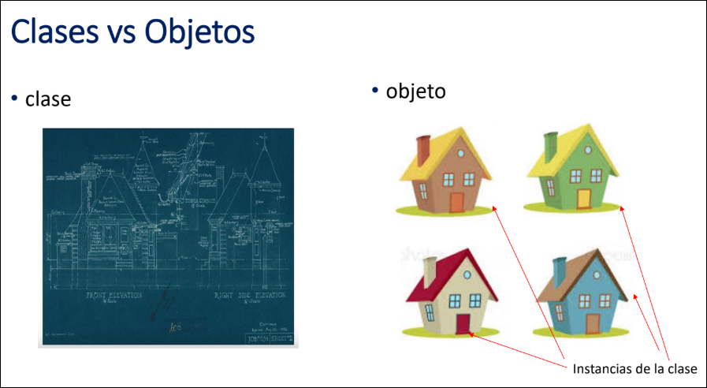

# Programación Orientada a Objetos
## Bases de POO
Luego de haber aprendido la programación estructural en fundamentos
de programación, es hora de explorar de las diferentes formas que disponemos
para resolver un problema, que no sea solo resolver el problema descomponiéndolo
y resolver pequeñas partes de ese problema.

Es aquí donde entra el paradigma (Forma de ver un problema) de la programación orientada
a objetos. En el paradigma de la programación orientada a objetos, no descomponemos 
el problema en problemas más pequeños, mas bien, lo descomponemos en objetos del mundo real.

### Objeto
Es la representación abstracta de una entidad o de un concepto. También se lo asocia 
con un elemento del problema.

Los objetos poseen *estados* y *comportamientos*:
- Estados: Valores de sus propiedades (atributos = propiedades).
- Comportamientos: Acciones que puede realizar el objeto (métodos).

### Clase
Una clase es un plano o mapa que define cuáles son los atributos y métodos
que un objeto tendrá. También se la conoce como *unidad básica* en POO.

- 

Entonces, cada clase define la plantilla de cómo se verá el objeto. El objeto, es, en realidad, la instancia de la plantilla o clase. De esta forma, cada objeto es independiente
y tiene su propio estado.

Antes de aprender POO, necesitamos un lenguaje para poder aplicar este 
paradigma. Por lo que procederemos a aprender sobre Java.

## Sintaxis de Java
### Sobre escribir como en python (De la nada)
Primero que todo, en Java, *Nada puede existir fuera de una clase*. Todas las variables
(atributos) y funciones (métodos) deben de estar en una clase, de lo contrario, no existe
y el fichero no se podría compilar.

#### Sobre cómo crear una plantilla (Clase)
La estructura para crear una clase siempre será la siguiente:
```Java
visibilidad class NombreDeClase{
  // code
}
```
El nombre de la clase siempre irá en *PascalCase*. Siempre y cuando ya exista una clase
con visibilidad pública, las demás deberán de ser del tipo default.

### Tipos de visibilidades
- Public: Lo ve todo el proyecto (Cualquier carpeta).
- Protected: Lo ven las clases de la misma carpeta y sus hijas (Herencia).
- Default: Solo lo ven las clases que comparten la misma carpeta.
- Private: Solo lo ve la misma clase que lo contiene entre sus llaves.

Existen clases privadas tanto dentro de la clase pública como dentro de una clase con visibilidad por defecto. No existen clases privadas fuera de la clase pública (No tendría sentido ocultarse de nadie).

Con esto podemos escribir el siguiente código y note que, a priori, no daría error.
```Java
// Nombre archivo: carro.java 
// Así, no es necesario que tengan el mismo nombre de la clase

class Vehicle {
  String color;
  int power;
  int seats;
}
```

```Java
// Nombre archivo: Vehicle.java
// Si es public, debe llamarse como el fichero
public class Vehicle {
  String color;
  int power;
  int seats;
}
```

En ambos casos, si lo llegase a compilar y a ejectuar, le saldría el mensaje de que 
efectivamente existe la plantilla pero no tiene un método Main (Nada a ejecutar).


### 1. Packpage

### 2. Import
Luego, van todas las librerías que se desea importar al proyecto.
```Java
import java.util.Scanner; // Para importar la librería Scanner
}
```

### 3. La "Clase principal"
Podrán existir N clases pero sólo una de ellas tendrá la keyword *public*. 
Dicha clase es la principal de todo el programa. Dentro de esa clase


### Clase Scanner
Scanner es una clase de Java que define propiedades y métodos (obviamente). Usamos ésta clase para crear objetos de tipo entrada de datos (Pedir datos al usuario). Para crear
una instancia de la clase Scanner en Java (Es decir, un objeto):

```Java
Scanner sc = new Scanner(System.in);
sc.nextInt();
}
```


## Nociones de java
- Todo código en Java vive en una clase (No puede estar suelta como en python).

- La JVM siempre buscará la función principal Main dentro de la clase principal.

- Static indica que la función o la variable siempre será la misma para todas las
  instancias de ese objeto. Todo objeto instanciado siempre se definirá de sus 
  métodos estáticos.

- Cada vez que ejecutamos código en la terminal, la JVM instancia un objeto de 
  éste, pero sólo lee el Main del objeto además de sus variables estáticas.
